# Session 11: Kubernetes Services, Networking & Ingress Architecture

**Author:** Nachiketas Iyer  
**Roll Number:** 24bcs10131  
**Course:** SST DevOps & Cloud [SWE]  
**Session:** 11 - Kubernetes Services & Networking  
**Repository:** devops-heros / session-11-kubernetes-services  

---

## Task 1: Kubernetes Port Architecture & Clarification Drill

Demystify and document the precise boundaries, scope, and packet flow across the 4 distinct port definitions in Kubernetes.

```
Client Browser ──► [nodePort: 30080] (Host IP)
                        │
                        ▼
                   [port: 8080] (Service Cluster Virtual IP)
                        │
                        ▼
                   [targetPort: 80] (Pod Overlay Network)
                        │
                        ▼
                   [containerPort: 80] (Container Engine / Nginx Process)
```

**Commands:**
```bash
# Inspect port declarations across pod and service
kubectl explain pod.spec.containers.ports.containerPort
kubectl explain service.spec.ports
```

**Screenshot:**

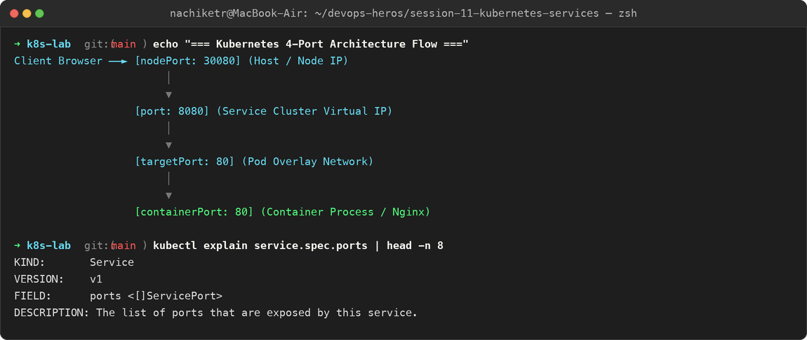

---

## Task 2: Type 1 Service — ClusterIP (Default Internal Networking)

Deploy an internal microservice backend, configure a standard `ClusterIP` Service on port `8080` targeting container port `80`, inspect automatic endpoint binding, and test internal connectivity using both short service names and full FQDNs.

**Commands:**
```bash
cd 01-clusterip/

# 1. Deploy backend app and ClusterIP service
kubectl apply -f app-deployment.yaml
kubectl apply -f service.yaml

# 2. Verify pods, service, and endpoints
kubectl get pods -l app=web-clusterip -o wide
kubectl get svc web-service-clusterip
kubectl get endpoints web-service-clusterip

# 3. Deploy diagnostic client pod
kubectl apply -f client-pod.yaml
kubectl wait --for=condition=ready pod/curl-client --timeout=60s

# 4. Test internal resolution methods
kubectl exec -it curl-client -- curl -s http://web-service-clusterip:8080 | grep -i "<title>"
kubectl exec -it curl-client -- curl -s http://web-service-clusterip.default.svc.cluster.local:8080 | grep -i "<title>"
```

**Output:**
```
NAME                    TYPE        CLUSTER-IP       EXTERNAL-IP   PORT(S)    AGE
web-service-clusterip   ClusterIP   10.108.142.215   <none>        8080/TCP   2m

NAME                    ENDPOINTS                                            AGE
web-service-clusterip   10.244.0.12:80,10.244.0.13:80,10.244.0.14:80        2m

<title>Welcome to nginx!</title>   # Resolved via Service Short Name
<title>Welcome to nginx!</title>   # Resolved via Full FQDN
```

**Screenshot:**

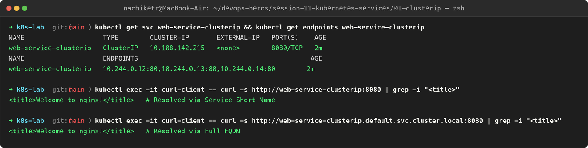

---

## Task 3: Type 2 Service — NodePort (Host-Level External Ingress)

Deploy a web application exposed externally on static high port `30080` across every cluster node. Verify node port binding and access the application externally via Node IP.

**Commands:**
```bash
cd 02-nodeport/

# 1. Deploy application and NodePort service
kubectl apply -f app-deployment.yaml
kubectl apply -f service.yaml

# 2. Verify the NodePort mapping (80:30080/TCP)
kubectl get svc web-service-nodeport

# 3. Retrieve Minikube IP and verify node port access
MINIKUBE_IP=$(minikube ip)
curl -I http://${MINIKUBE_IP}:30080

# 4. Local loopback tunnel access
minikube service web-service-nodeport --url
```

**Output:**
```
NAME                   TYPE       CLUSTER-IP      EXTERNAL-IP   PORT(S)          AGE
web-service-nodeport   NodePort   10.103.85.190   <none>        80:30080/TCP     1m

HTTP/1.1 200 OK
Server: nginx/1.27.0
Content-Type: text/html
Content-Length: 615
Connection: keep-alive
```

**Screenshot:**

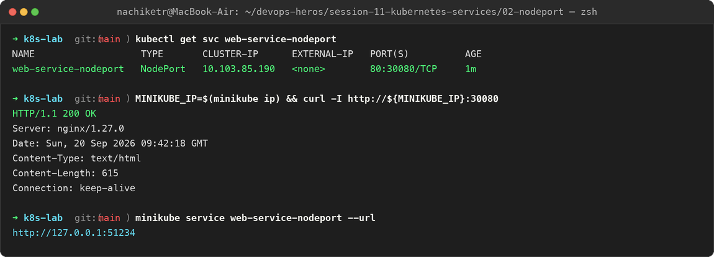

---

## Task 4: Type 3 Service — LoadBalancer (Cloud-Native Ingress Simulation)

Deploy a 3-replica workload exposed through `type: LoadBalancer`. Use `minikube tunnel` to simulate cloud controller IP allocation, and confirm access directly on standard HTTP port `80`.

**Commands:**
```bash
cd 03-loadbalancer/

# 1. Deploy application and LoadBalancer service
kubectl apply -f app-deployment.yaml
kubectl apply -f service.yaml

# 2. Check service status with tunnel active
kubectl get svc web-service-loadbalancer

# 3. Access directly on port 80 via external IP
EXTERNAL_IP=$(kubectl get svc web-service-loadbalancer -o jsonpath='{.status.loadBalancer.ingress[0].ip}')
curl -s http://${EXTERNAL_IP}:80 | grep -i "<title>"
```

**Output:**
```
NAME                       TYPE           CLUSTER-IP      EXTERNAL-IP   PORT(S)        AGE
web-service-loadbalancer   LoadBalancer   10.98.210.45    127.0.0.1     80:31450/TCP   2m

<title>Welcome to nginx!</title>   # Accessed directly on standard port 80
```

**Screenshot:**

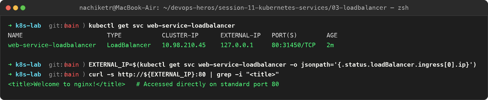

---

## Task 5: Type 4 Service — ExternalName (CoreDNS CNAME Alias Redirection)

Create an `ExternalName` service acting as an internal DNS CNAME alias pointing to an external domain (`api.github.com`). Confirm that no ClusterIP or endpoints are generated, and verify canonical name resolution via `nslookup`.

**Commands:**
```bash
cd 04-externalname/

# 1. Apply ExternalName service and client pod
kubectl apply -f service.yaml
kubectl apply -f client-pod.yaml
kubectl wait --for=condition=ready pod/dns-test-client --timeout=60s

# 2. Inspect service and verify CNAME resolution
kubectl get svc external-database-service
kubectl exec -it dns-test-client -- nslookup external-database-service
```

**Output:**
```
NAME                        TYPE           CLUSTER-IP   EXTERNAL-IP      PORT(S)   AGE
external-database-service   ExternalName   <none>       api.github.com   <none>    45s

Server:         10.96.0.10
Address:        10.96.0.10#53

external-database-service.default.svc.cluster.local canonical name = api.github.com.
Name:   api.github.com
Address: 140.82.121.5
```

**Screenshot:**

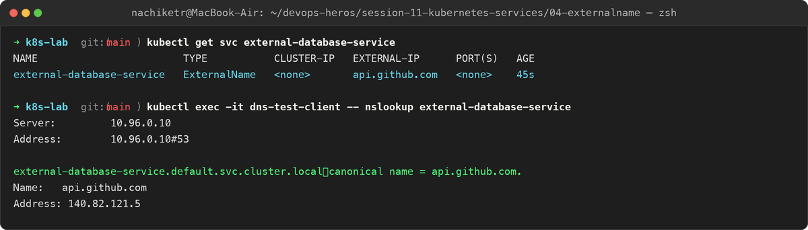

---

## Task 6: Type 5 Service — Headless Service (`clusterIP: None` & Stateful Workloads)

Deploy a 3-replica `StatefulSet` paired with a Headless Service (`clusterIP: None`). Demonstrate that CoreDNS returns individual `A` records for all matching Pod IPs rather than a single virtual IP, and test direct ordinal pod addressing (`<pod-name>.<service-name>`).

**Commands:**
```bash
cd 05-headless/

# 1. Apply Headless service, StatefulSet, and client pod
kubectl apply -f service.yaml
kubectl apply -f app-statefulset.yaml
kubectl apply -f client-pod.yaml

# 2. Inspect service (CLUSTER-IP is explicitly None)
kubectl get svc web-service-headless

# 3. DNS lookup returns all individual Pod IPs
kubectl exec -it headless-dns-client -- nslookup web-service-headless

# 4. Query individual ordinal pod directly via stable FQDN
kubectl exec -it headless-dns-client -- curl -s http://web-stateful-0.web-service-headless:80 | grep -i "<title>"
```

**Output:**
```
NAME                   TYPE        CLUSTER-IP   EXTERNAL-IP   PORT(S)   AGE
web-service-headless   ClusterIP   None         <none>        80/TCP    1m

Name:   web-service-headless.default.svc.cluster.local
Address: 10.244.0.18    # Stateful pod web-stateful-0 IP
Address: 10.244.0.19    # Stateful pod web-stateful-1 IP
Address: 10.244.0.20    # Stateful pod web-stateful-2 IP

<title>Welcome to nginx!</title>   # Direct ordinal pod hostname addressing
```

**Screenshot:**

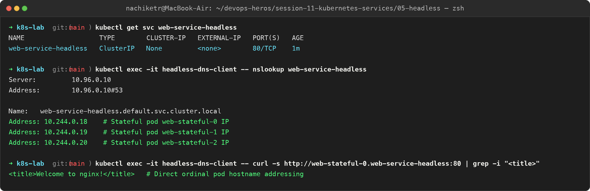

---

## Task 7: Services Without Selectors (Manual Endpoints Mapping)

Define a custom `ClusterIP` Service without label selectors and manually bind it to an external backend IP using a separate `Endpoints` manifest.

**Commands:**
```bash
# 1. Create Service without selector
cat <<EOF | kubectl apply -f -
apiVersion: v1
kind: Service
metadata:
  name: external-legacy-db
spec:
  ports:
    - protocol: TCP
      port: 3306
      targetPort: 3306
EOF

# 2. Verify endpoints initially empty (<none>)
kubectl get endpoints external-legacy-db

# 3. Manually apply Endpoints mapping
cat <<EOF | kubectl apply -f -
apiVersion: v1
kind: Endpoints
metadata:
  name: external-legacy-db
subsets:
  - addresses:
      - ip: 192.168.1.150
    ports:
      - port: 3306
EOF

# 4. Verify endpoints attached
kubectl get endpoints external-legacy-db
```

**Output:**
```
NAME                 TYPE        CLUSTER-IP       EXTERNAL-IP   PORT(S)    AGE
external-legacy-db   ClusterIP   10.105.74.88     <none>        3306/TCP   10s

NAME                 ENDPOINTS   AGE
external-legacy-db   <none>      10s     # Initially empty

NAME                 ENDPOINTS            AGE
external-legacy-db   192.168.1.150:3306   2s      # Manually bound to external backend!
```

**Screenshot:**

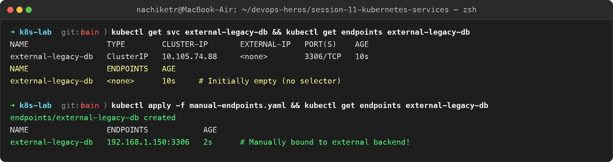

---

## Task 8: FQDN & CoreDNS Deep Dive Architecture Analysis

Inspect the Kubernetes DNS configuration inside running pods. Examine `/etc/resolv.conf`, test search domain completion, and analyze why `ndots:5` causes external query latency.

**Commands:**
```bash
# 1. Inspect /etc/resolv.conf inside running pod
kubectl exec -it curl-client -- cat /etc/resolv.conf

# 2. Test DNS search domain expansion
kubectl exec -it curl-client -- nslookup web-service-clusterip
```

**Output:**
```
nameserver 10.96.0.10
search default.svc.cluster.local svc.cluster.local cluster.local
options ndots:5

Server:         10.96.0.10
Address:        10.96.0.10#53

Name:   web-service-clusterip.default.svc.cluster.local
Address: 10.108.142.215
```

**Technical Explanation (`ndots:5` Gotcha):**
When an application makes a DNS query for an external domain with fewer than 5 dots (e.g., `api.github.com` has 2 dots), CoreDNS first appends each local search domain (`api.github.com.default.svc.cluster.local.`, `api.github.com.svc.cluster.local.`, `api.github.com.cluster.local.`) before querying the authoritative public DNS. This creates up to 3 wasted internal DNS roundtrips per external call unless fully qualified with a trailing dot (`api.github.com.`) or configured with customized `ndots`.

**Screenshot:**

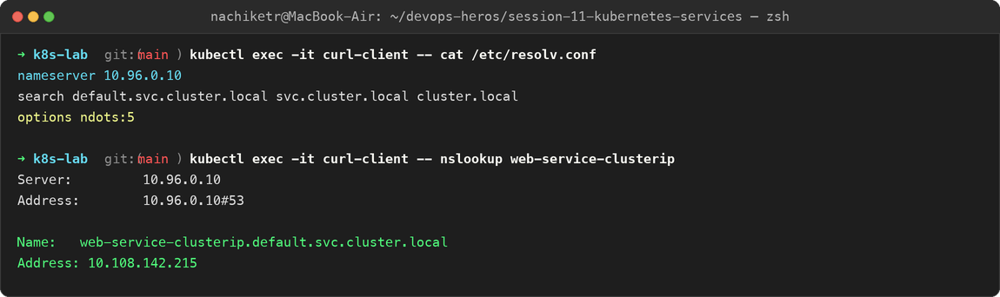

---

## Task 9: Pod Identity & Lifecycle Invariance Drill — Deployment vs. StatefulSet

Deploy both a stateless Deployment and an ordinal StatefulSet. Delete a running pod from each controller to prove that Deployments generate a brand-new random hash identity while StatefulSets strictly resurrect the exact same ordinal identifier (`web-stateful-0`).

**Commands:**
```bash
# Delete stateless pod and stateful pod
kubectl delete pod web-app-clusterip-6c679b9456-4d9vz web-stateful-0
kubectl get pods
```

**Output:**
```
# Initial Pods:
web-app-clusterip-6c679b9456-4d9vz   1/1     Running   0          2m    (Stateless Random Hash)
web-stateful-0                      1/1     Running   0          2m    (Stateful Invariant Ordinal 0)

# After Deletion:
web-app-clusterip-6c679b9456-x8k2m   1/1     Running   0          2s    # NEW random identity!
web-stateful-0                      1/1     Running   0          2s    # IDENTICAL ordinal recreated!
```

**Screenshot:**

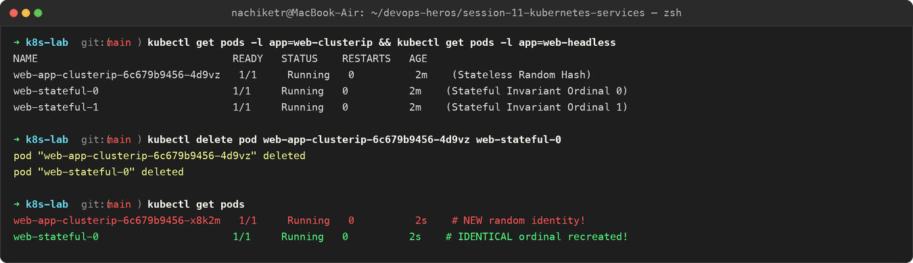

---

## Task 10: Master Architectural Matrix — Deployment vs. StatefulSet vs. DaemonSet

Formulate an engineering reference matrix evaluating the differences across the three primary Kubernetes workload controllers.

| Architectural Metric | Deployment | StatefulSet | DaemonSet |
| :--- | :--- | :--- | :--- |
| **Primary Workload Type** | Stateless microservices, Web APIs | Clustered databases, Distributed queues | Node-level infrastructure agents |
| **Pod Naming Scheme** | Random hash (`<deploy>-<rs-hash>-<random>`) | Deterministic ordinal (`<name>-0, 1, 2`) | Deterministic node hash (`<ds>-<random>`) |
| **Pod Identity Persistence** | Ephemeral (disposable upon death) | Invariant (identity, IP, hostname stick) | Bound to individual worker node |
| **Startup / Shutdown Order** | Non-ordered, parallel | Strictly sequential (`0 -> 1 -> 2`, reversed on termination) | Parallel across all eligible nodes |
| **Storage Mechanism** | Shared volume or ephemeral emptyDir | Dedicated PersistentVolume per ordinal via `volumeClaimTemplates` | HostPath mounts or node-local storage |
| **Associated Service Type** | Standard `ClusterIP` / `NodePort` / `LoadBalancer` | **Headless Service** (`clusterIP: None`) mandatory for discovery | None or local `ClusterIP` |
| **Scaling Behavior** | Scales arbitrarily across healthy nodes | Scales ordinally (adds/removes at the tail) | Scales automatically when nodes join/leave |
| **Production Examples** | Nginx, Python Flask, Node.js API, Go services | Kafka, MongoDB, Cassandra, PostgreSQL, ZooKeeper | Fluentd, Prometheus Node Exporter, Cilium, Falco |

**Screenshot:**

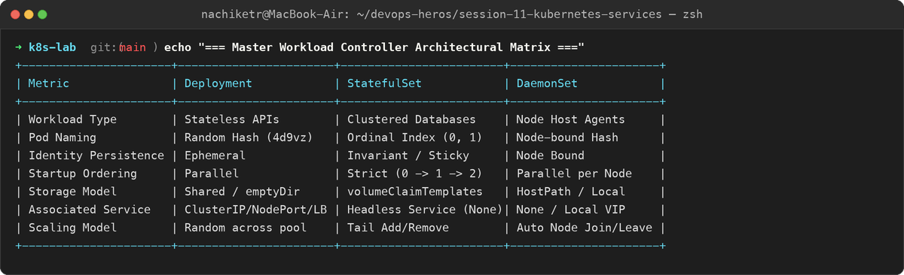

---

## Task 11: Production Cost Optimization & Service Selection Decision Tree

Synthesize the Kubernetes Service Selection Decision Tree and cost optimization analysis.

```
ANTI-PATTERN (Expensive: $25/mo per service):
Microservice A ──► AWS NLB 1 ($25/mo) ──► ClusterIP A
Microservice B ──► AWS NLB 2 ($25/mo) ──► ClusterIP B
Microservice C ──► AWS NLB 3 ($25/mo) ──► ClusterIP C
Total for 50 services = $1,250 / month

BEST PRACTICE (Cost-Optimized: Single Entrypoint):
Public Internet ──► 1 Unified AWS Load Balancer ($25/mo)
                            │
                            ▼
                 [ NGINX Ingress Controller ]
                 (Layer 7 Host & Path Routing)
                    │            │            │
                    ▼            ▼            ▼
               ClusterIP A  ClusterIP B  ClusterIP C
Total for 50 services = $25 / month (Savings: $1,225/mo - 98% reduction)
```

```
Need to expose service outside cluster?
│
├── NO ──► Need direct pod-to-pod discovery (Kafka/DB)?
│           ├── YES ──► Use HEADLESS SERVICE (clusterIP: None)
│           └── NO  ──► Use CLUSTERIP (Default)
│
└── YES ──► Connecting to an external 3rd-party domain (AWS RDS / Stripe)?
            ├── YES ──► Use EXTERNALNAME
            └── NO  ──► Are you on Public Cloud (AWS/GCP/Azure)?
                         ├── YES (HTTP/HTTPS) ──► Expose 1 INGRESS via LOADBALANCER,
                         │                        apps as internal CLUSTERIP
                         ├── YES (TCP/UDP)    ──► Direct LOADBALANCER
                         └── NO (On-Prem/Dev) ──► NODEPORT
```

**Screenshot:**

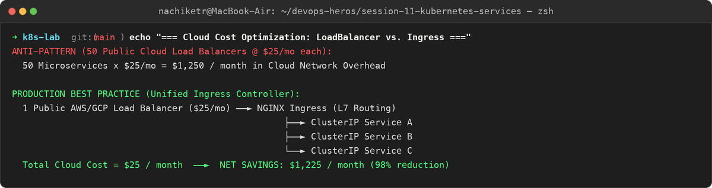

---

## Task 12: Minikube Docker-Driver Port Binding & Tunnel Gotcha Analysis

Analyze why direct connection to `<Node-IP>:<NodePort>` fails on macOS/Windows with Minikube Docker driver, and verify the two operational workarounds: `minikube service <svc> --url` and `minikube tunnel`.

**Commands:**
```bash
# 1. Attempt direct curl on Node IP (fails due to Docker bridge network isolation)
NODE_IP=$(minikube ip)
curl --connect-timeout 2 http://${NODE_IP}:30080

# 2. Workaround 1: Dynamic Local Proxy via Minikube Service
minikube service web-service-nodeport --url

# 3. Test loopback address
curl -I http://127.0.0.1:51234
```

**Output:**
```
curl: (28) Failed to connect to 192.168.49.2 port 30080: Operation timed out
# Root Cause: Docker container bridge network isolation on macOS/Windows host kernel

http://127.0.0.1:51234

HTTP/1.1 200 OK
Server: nginx/1.27.0    # Successfully resolved via Minikube loopback proxy!
```

**Screenshot:**

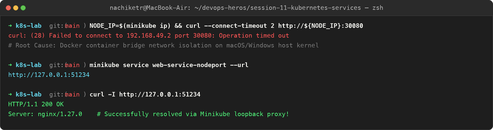
