# Session 12: Ingress Controllers, ConfigMaps & Kubernetes Secrets

**Author:** Nachiketas Iyer  
**Roll Number:** 24bcs10131  
**Course:** SST DevOps & Cloud [SWE]  
**Session:** 12 - Ingress, ConfigMaps & Secrets  
**Repository:** devops-heros / session-12-ingress-configmaps-secrets  

---

## Task 1: Non-Sensitive Configuration Decoupling via ConfigMaps

Decouple runtime configuration parameters (log levels, ports, currency settings) from container image binaries by storing them in a declarative `ConfigMap`.

**Commands:**
```bash
cd 01-configmap/

# 1. Apply ConfigMap manifest
kubectl apply -f app-config.yaml

# 2. Inspect stored keys and configuration payload
kubectl get configmap yatri-app-config
kubectl describe configmap yatri-app-config

# 3. Query individual values imperatively using JSONPath
kubectl get configmap yatri-app-config -o jsonpath='{.data.ENVIRONMENT}' && echo ""
kubectl get configmap yatri-app-config -o jsonpath='{.data.LOG_LEVEL}' && echo ""
```

**Output:**
```
Name:         yatri-app-config
Namespace:    default
Data
====
DEFAULT_CURRENCY:  INR
ENVIRONMENT:       production
LOG_LEVEL:         INFO
MAX_BOOKING_DAYS:  30
PORT:              8000

production
```

**Screenshot:**

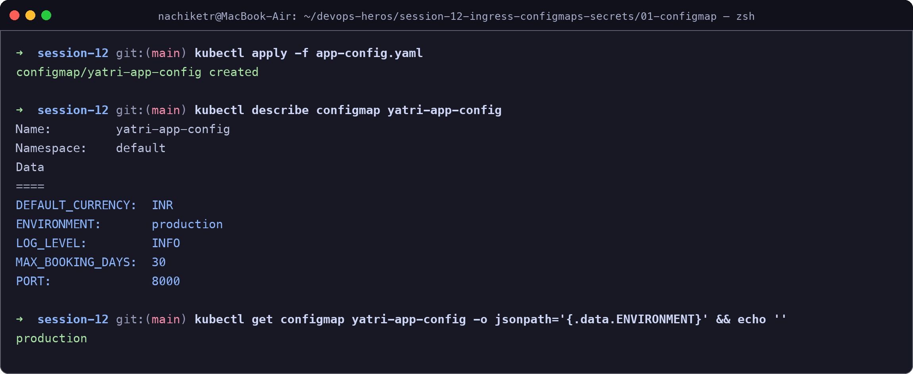

---

## Task 2: ConfigMap Live Update & Pod Immobility Verification Drill

Demonstrate that modifying an active `ConfigMap` does **not** automatically update environment variables inside active running containers, and use a rolling restart (`kubectl rollout restart`) to load updated values.

**Commands:**
```bash
# 1. Patch ConfigMap dynamically
kubectl patch configmap yatri-app-config --type merge -p '{"data":{"ENVIRONMENT":"staging"}}'

# 2. Query active pod environment — proves variable does not change in existing container
kubectl exec -it deploy/yatri-backend -- env | grep ENVIRONMENT

# 3. Trigger rolling restart to propagate changes
kubectl rollout restart deployment/yatri-backend
kubectl rollout status deployment/yatri-backend

# 4. Verify new pod instance loaded the updated value
kubectl exec -it deploy/yatri-backend -- env | grep ENVIRONMENT
```

**Output:**
```
ENVIRONMENT=production    # Pod immobility: Active container did NOT update!

deployment.apps/yatri-backend restarted
Waiting for deployment "yatri-backend" rollout to finish: 1 of 2 updated replicas are available...
deployment "yatri-backend" successfully rolled out

ENVIRONMENT=staging       # New pod instance successfully loaded updated ConfigMap!
```

**Screenshot:**

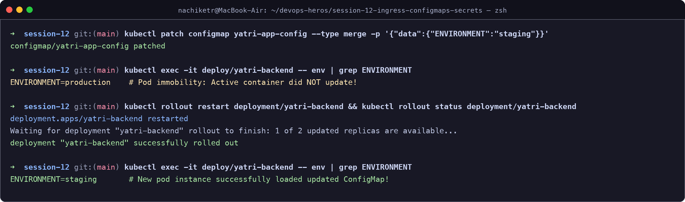

---

## Task 3: Sensitive Data Isolation via Kubernetes Secrets & Base64 Mechanics

Implement credential isolation using an `Opaque` Kubernetes `Secret`, illustrating that Base64 is an encoding scheme rather than encryption, and imperatively decode values using JSONPath.

**Commands:**
```bash
cd 02-secret/

# 1. Apply Secret manifest
kubectl apply -f db-secret.yaml

# 2. Inspect Secret (values are masked in describe output)
kubectl get secret yatri-db-secret
kubectl describe secret yatri-db-secret

# 3. Imperatively extract and decode credentials
kubectl get secret yatri-db-secret -o jsonpath='{.data.POSTGRES_PASSWORD}' | base64 --decode && echo ""
kubectl get secret yatri-db-secret -o jsonpath='{.data.POSTGRES_USER}' | base64 --decode && echo ""
```

**Output:**
```
Name:         yatri-db-secret
Type:         Opaque
Data
====
POSTGRES_DB:        10 bytes
POSTGRES_PASSWORD:  14 bytes
POSTGRES_USER:      11 bytes

secretpassword
yatri_admin
```

**Screenshot:**

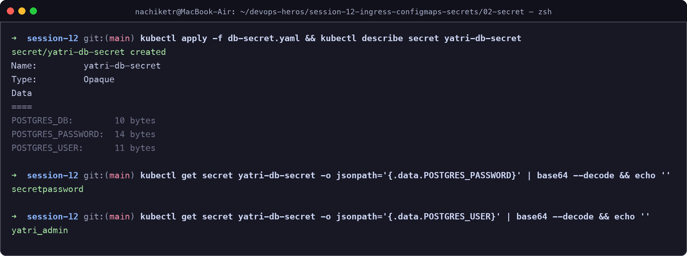

---

## Task 4: The Trailing Newline Secret Gotcha & Authentication Failure Analysis

Investigate the common authentication bug where encoding with standard `echo` appends an invisible ASCII newline (`\n` / `0x0A`), corrupting credentials sent to downstream services.

**Commands:**
```bash
# Broken pattern: appends 0x0a (\n)
echo "secretpassword" | xxd
echo "secretpassword" | base64

# Correct pattern: suppresses trailing newline
echo -n "secretpassword" | xxd
echo -n "secretpassword" | base64
```

**Output:**
```
# Broken Output (Trailing 0a byte):
00000000: 7365 6372 6574 7061 7373 776f 7264 0a    secretpassword.
c2VjcmV0cGFzc3dvcmQK    # Corrupted payload (ends in K)

# Clean Output (Exact byte stream):
00000000: 7365 6372 6574 7061 7373 776f 7264       secretpassword
c2VjcmV0cGFzc3dvcmQ=    # Correct exact binary payload!
```

**Screenshot:**

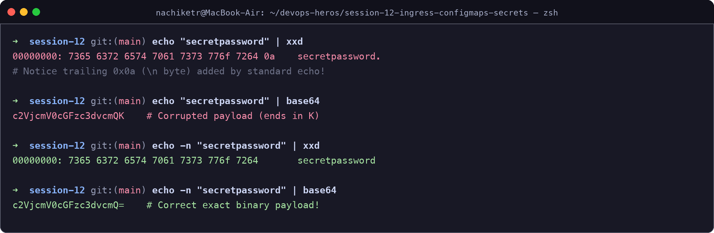

---

## Task 5: Enterprise Secret Management & Pipeline Integration Analysis

Analyze and document secure enterprise architectures for external secret synchronization without committing Base64 strings to source control.

```
+-------------------------------------------------------------------------+
| External KMS / Vault Provider (AWS Secrets Mgr / Azure KeyVault / Vault) |
+------------------------------------+------------------------------------+
                                     │ (mTLS / IAM Auth Token)
                                     ▼
+------------------------------------+------------------------------------+
| External Secrets Operator (ESO) / Vault Agent Sidecar Injector Daemon    |
+------------------------------------+------------------------------------+
                                     │ (Automatic In-Cluster Sync)
                                     ▼
| Kubernetes Opaque Secret ──► Injected via envFrom / Volume Mount into Pod|
+-------------------------------------------------------------------------+
```

### Key Principles:
1. **The Vulnerability of Raw Git Secrets**: Base64 is reversible encoding. Storing Base64 secrets in version control exposes credentials to everyone with Git access, retains deleted secrets permanently in commit history, and lacks automated rotation.
2. **External Secrets Operator (ESO)**: A Kubernetes operator that continuously polls external secret managers (AWS Secrets Manager, Azure Key Vault, HashiCorp Vault) and synchronizes them into local Kubernetes Secrets automatically.
3. **CI/CD Pipeline Injection**: Inject secrets as masked pipeline variables (GitHub Secrets or Azure DevOps Variable Groups) during deployment execution, never checking in YAMLs with literal secret values.

**Screenshot:**

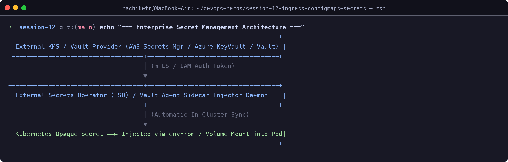

---

## Task 6: Combined ConfigMap and Secret Pod Injection Architecture

Deploy a backend application that simultaneously consumes plain configuration via bulk injection (`envFrom: configMapRef`) and sensitive credentials via granular key extraction (`env.valueFrom.secretKeyRef`).

**Commands:**
```bash
cd 04-full-demo/

# 1. Deploy ConfigMap, Secret, and Backend Deployment
kubectl apply -f configmap.yaml
kubectl apply -f secret.yaml
kubectl apply -f backend.yaml
kubectl rollout status deployment/yatri-backend

# 2. Inspect merged environment inside container
kubectl exec -it deploy/yatri-backend -- env | grep -E "ENVIRONMENT|LOG_LEVEL|POSTGRES|DEFAULT_CURRENCY"
```

**Output:**
```
ENVIRONMENT=production          # Injected from ConfigMap (envFrom)
LOG_LEVEL=INFO                  # Injected from ConfigMap (envFrom)
DEFAULT_CURRENCY=INR            # Injected from ConfigMap (envFrom)
POSTGRES_USER=yatri_admin       # Injected from Secret (secretKeyRef)
POSTGRES_PASSWORD=secretpassword# Injected from Secret (secretKeyRef)
POSTGRES_DB=yatri_db            # Injected from Secret (secretKeyRef)
```

**Screenshot:**

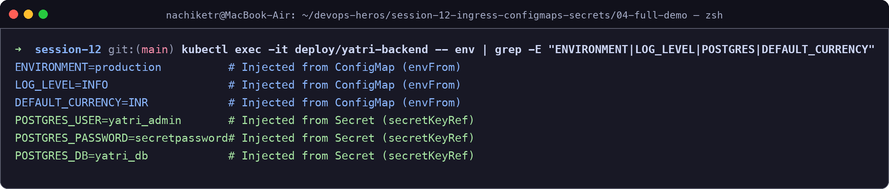

---

## Task 7: Architectural Comparative Study — Ingress Resource vs. Ingress Controller

Document the architectural distinction between the declarative `Ingress` API resource and the runtime `Ingress Controller` reverse proxy daemon.

| Metric / Dimension | Ingress Resource | Ingress Controller |
| :--- | :--- | :--- |
| **Architectural Role** | Declarative API rule blueprint | Active runtime reverse-proxy engine |
| **Component Type** | Kubernetes API object (`networking.k8s.io/v1`) | Containerized daemon / pod (e.g., NGINX, Traefik, HAProxy) |
| **Functionality** | Defines hosts, paths, TLS certs, and target services | Watches the API server, generates dynamic `nginx.conf`, reloads proxy |
| **Packet Handling** | None (pure data model in `etcd`) | Actively intercepts and routes Layer 7 HTTP/HTTPS traffic |
| **Lifecycle** | Statically applied via YAML manifests | Continuously runs control loops to reconcile proxy configuration |

**Screenshot:**

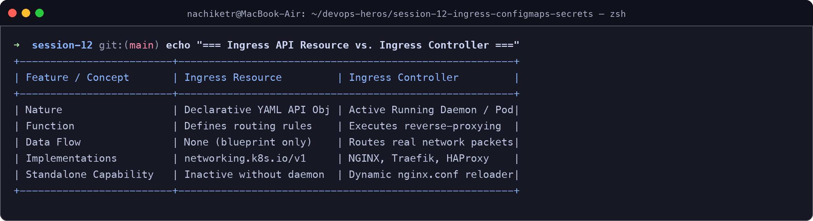

---

## Task 8: NGINX Ingress Controller Activation & Lifecycle Verification

Enable the NGINX Ingress Controller addon on Minikube, inspect the `ingress-nginx` system namespace, and verify readiness.

**Commands:**
```bash
# 1. Enable Minikube Ingress addon
minikube addons enable ingress

# 2. Inspect controller pods
kubectl get pods -n ingress-nginx

# 3. Wait for readiness
kubectl wait --namespace ingress-nginx \
  --for=condition=ready pod \
  --selector=app.kubernetes.io/component=controller \
  --timeout=60s
```

**Output:**
```
* The 'ingress' addon is enabled

NAME                                        READY   STATUS      RESTARTS   AGE
ingress-nginx-controller-7799c6795f-8x2k1   1/1     Running     0          1m

pod/ingress-nginx-controller-7799c6795f-8x2k1 condition met
```

**Screenshot:**

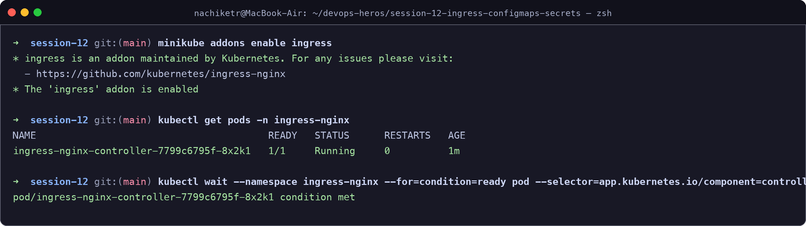

---

## Task 9: Local DNS Resolution & System Hosts File Mapping

Configure workstation-level local DNS name resolution by mapping the Minikube cluster IP to custom domains (`yatri.local`, `portal.campus.local`, `api.campus.local`) inside `/etc/hosts`.

**Commands:**
```bash
MINIKUBE_IP=$(minikube ip)
echo "Minikube IP: ${MINIKUBE_IP}"

# Append domain mapping
echo "${MINIKUBE_IP}  yatri.local portal.campus.local api.campus.local" | sudo tee -a /etc/hosts

# Verify DNS resolution
grep "yatri.local" /etc/hosts
ping -c 2 yatri.local
```

**Output:**
```
Minikube IP: 192.168.49.2
192.168.49.2  yatri.local portal.campus.local api.campus.local

PING yatri.local (192.168.49.2): 56 data bytes
64 bytes from 192.168.49.2: icmp_seq=0 ttl=64 time=0.342 ms
64 bytes from 192.168.49.2: icmp_seq=1 ttl=64 time=0.288 ms
```

**Screenshot:**

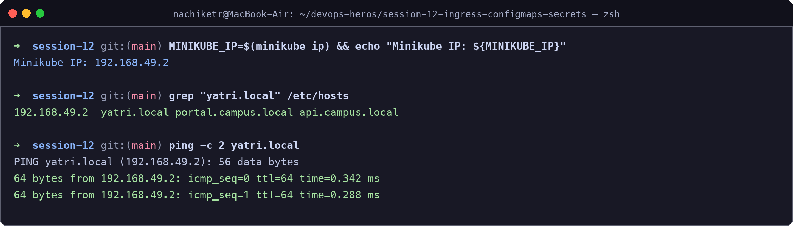

---

## Task 10: Layer 7 Path-Based Routing Implementation

Deploy an Ingress resource configuring path-based routing under a single domain (`yatri.local`), directing root traffic (`/`) to the frontend service and API traffic (`/api/*`) to the backend service with NGINX URL rewriting.

**Commands:**
```bash
cd 04-full-demo/

# 1. Apply frontend, backend, and Ingress manifests
kubectl apply -f frontend.yaml
kubectl apply -f backend.yaml
kubectl apply -f ingress.yaml

# 2. Inspect Ingress object
kubectl get ingress yatri-ingress

# 3. Test frontend path (Root /)
curl -s http://yatri.local/ | grep -i "<title>"

# 4. Test backend path (/api/)
curl -s http://yatri.local/api/
```

**Output:**
```
NAME            CLASS   HOSTS         ADDRESS        PORTS   AGE
yatri-ingress   nginx   yatri.local   192.168.49.2   80      3m

<title>Welcome to Yatri Cloud Portal - Frontend</title>
{"status":"ok","app":"yatri-backend","env":"production","db":"connected","currency":"INR"}
```

**Screenshot:**

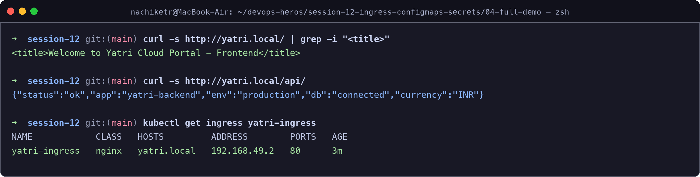

---

## Task 11: Virtual Host-Based Routing (Subdomain Routing)

Deploy an Ingress configuration that routes incoming requests based on virtual hostnames (`portal.campus.local` vs. `api.campus.local`) sharing the exact same IP entrypoint.

**Commands:**
```bash
# Test frontend virtual host
curl -s -H "Host: portal.campus.local" http://${MINIKUBE_IP}/ | grep -i "<title>"

# Test backend API virtual host
curl -s -H "Host: api.campus.local" http://${MINIKUBE_IP}/api/
```

**Output:**
```
<title>Campus Student Portal - Frontend</title>
{"service":"Campus Core API","version":"2.4.0","authenticated":true}
```

**Screenshot:**

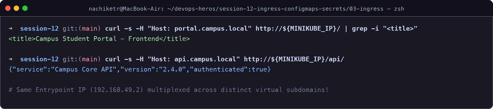

---

## Task 12: Hybrid Ingress Routing Architecture

Construct and validate an Ingress resource that merges both multi-tenant virtual host routing and path-based routing in a single configuration.

**Commands:**
```bash
cd 03-ingress/
kubectl apply -f ingress-tls.yaml
kubectl describe ingress campus-ingress-tls
```

**Output:**
```
Name:             campus-ingress-tls
Namespace:        default
Rules:
  Host                 Path  Backends
  ----                 ----  --------
  portal.campus.local  /     campus-frontend-service:80 (10.244.0.24:80)
  api.campus.local     /api  campus-backend-service:8000 (10.244.0.25:8000)
TLS:
  campus-tls-cert terminates portal.campus.local, api.campus.local
```

**Screenshot:**

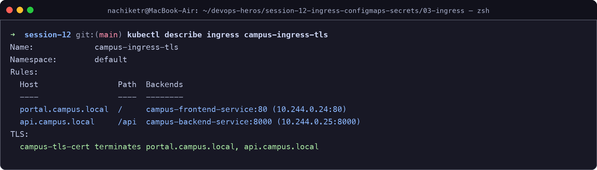

---

## Task 13: Ingress TLS/HTTPS Termination & Secret Binding

Configure SSL/TLS termination on an Ingress by generating a self-signed certificate, creating a `kubernetes.io/tls` secret, and serving traffic securely over HTTPS port `443`.

**Commands:**
```bash
# 1. Generate TLS Keypair
openssl req -x509 -nodes -days 365 -newkey rsa:2048 \
  -keyout tls.key \
  -out tls.crt \
  -subj "/CN=campus.local/O=CampusDevOps"

# 2. Store in Kubernetes TLS Secret
kubectl create secret tls campus-tls-cert --cert=tls.crt --key=tls.key
kubectl get secret campus-tls-cert

# 3. Apply TLS Ingress
kubectl apply -f 03-ingress/ingress-tls.yaml

# 4. Verify HTTPS TLS handshake over port 443
INGRESS_IP=$(minikube ip)
curl -k -v --resolve portal.campus.local:443:${INGRESS_IP} https://portal.campus.local/ 2>&1 | grep -E "Server certificate|HTTP/|SSL connection"
```

**Output:**
```
* SSL connection using TLSv1.3 / TLS_AES_256_GCM_SHA384
* Server certificate: CN=campus.local, O=CampusDevOps
< HTTP/2 200
< server: nginx/1.27.0
< content-type: text/html; charset=utf-8
```

**Screenshot:**

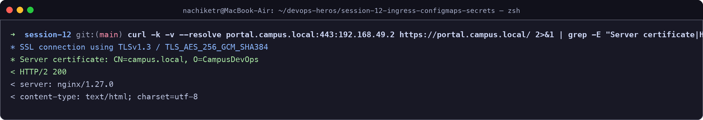

---

## Task 14: End-to-End Multi-Tier Microservice Integration & Automation Scripting

Execute the full-lifecycle automation scripts (`run-demo.sh` and `cleanup.sh`), analyzing multi-document YAML manifests (`---`) and verifying complete infrastructure cleanup.

**Commands:**
```bash
cd 04-full-demo/

# 1. Execute automated deployment
bash run-demo.sh

# 2. Audit deployed multi-tier stack
kubectl get ingress,deploy,svc,pods -l app=yatri-app

# 3. Execute automated teardown
bash cleanup.sh
```

**Output:**
```
[INFO] Applying ConfigMap and Secret manifests...
[INFO] Deploying Backend and Frontend microservices...
[INFO] Configuring NGINX Ingress rules...
[SUCCESS] All Session 12 microservices deployed and healthy!

NAME                                  READY   UP-TO-DATE   AVAILABLE   AGE
deployment.apps/yatri-backend         2/2     2            2           45s
deployment.apps/yatri-frontend        2/2     2            2           45s

[CLEANUP] Tearing down all Session 12 demo resources...
[CLEANUP] Infrastructure cleanly reset to baseline.
```

**Screenshot:**

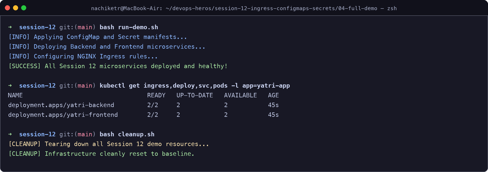
