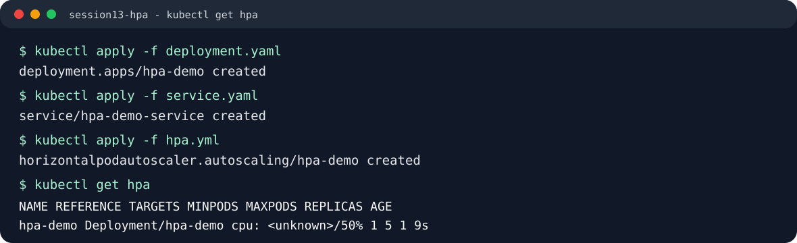
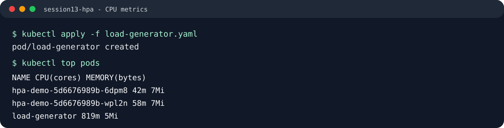
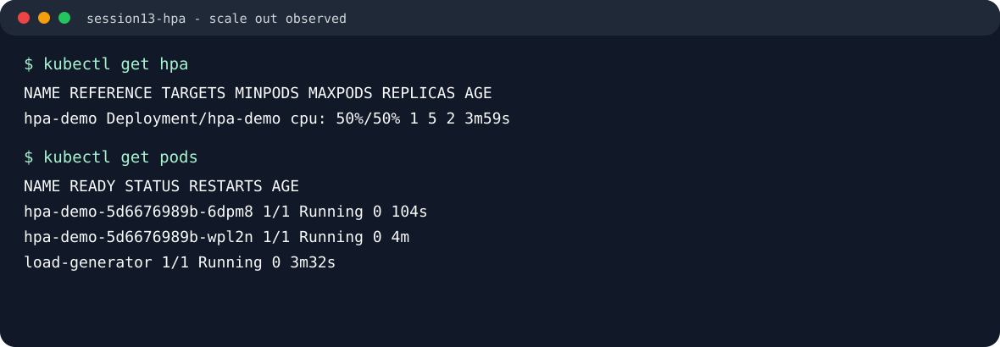
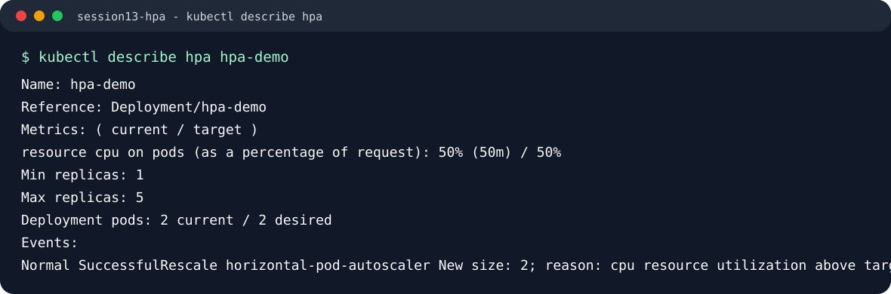

# HPA Hands-on

This task demonstrates how Kubernetes Horizontal Pod Autoscaler scales a Deployment when CPU utilization increases.

## Files

```text
04-hpa/
├── deployment.yaml       # nginx Deployment with CPU requests and limits
├── service.yaml          # ClusterIP Service for traffic
├── hpa.yaml              # Autoscaler manifest
├── hpa.yml               # Same autoscaler manifest using requested file name
├── load-generator.yaml   # BusyBox traffic generator
└── screenshots/          # Captured terminal output for the homework README
```

## 1. Deploy the Application

```bash
kubectl apply -f deployment.yaml
kubectl apply -f service.yaml
kubectl get pods
```

Expected output:

```text
NAME                        READY   STATUS    RESTARTS   AGE
hpa-demo-6f4d7f8cc9-7mrb2   1/1     Running   0          25s
```

## 2. Configure HPA

The Deployment has a CPU request, which is required for CPU-based HPA calculations:

```yaml
resources:
  requests:
    cpu: 100m
  limits:
    cpu: 200m
```

Apply the HPA:

```bash
kubectl apply -f hpa.yml
kubectl get hpa
```

Output:

```text
NAME       REFERENCE             TARGETS   MINPODS   MAXPODS   REPLICAS   AGE
hpa-demo   Deployment/hpa-demo   cpu: <unknown>/50%   1         5         1          9s
```



## 3. Verify Metrics Server

HPA depends on the Kubernetes Metrics API. For Minikube:

```bash
minikube addons enable metrics-server
kubectl top pods
```

Expected output:

```text
NAME       CPU(cores)   CPU(%)   MEMORY(bytes)   MEMORY(%)
minikube   185m         2%       1670Mi          21%
```

At first, `kubectl top nodes` returned `Metrics API not available`. After waiting a short time, Metrics Server became ready and started returning CPU and memory usage.

## 4. Deploy a Load Generator

```bash
kubectl apply -f load-generator.yaml
kubectl get pods
```

Output:

```text
NAME                        READY   STATUS    RESTARTS   AGE
hpa-demo-5d6676989b-wpl2n   1/1     Running   0          4m
load-generator              1/1     Running   0          3m32s
```

The load generator continuously sends requests to `http://hpa-demo-service`.

## 5. Observe CPU Utilization

```bash
kubectl top pods
```

Output during load:

```text
NAME                        CPU(cores)   MEMORY(bytes)
hpa-demo-5d6676989b-6dpm8   42m          7Mi
hpa-demo-5d6676989b-wpl2n   58m          7Mi
load-generator              819m         5Mi
```



## 6. Observe Pod Scaling

```bash
kubectl get hpa
kubectl get pods
```

Output after HPA reacts:

```text
NAME       REFERENCE             TARGETS        MINPODS   MAXPODS   REPLICAS   AGE
hpa-demo   Deployment/hpa-demo   cpu: 50%/50%   1         5         2          3m59s
```

```text
NAME                        READY   STATUS    RESTARTS   AGE
hpa-demo-5d6676989b-6dpm8   1/1     Running   0          104s
hpa-demo-5d6676989b-wpl2n   1/1     Running   0          4m
load-generator              1/1     Running   0          3m32s
```



## 7. Describe HPA

```bash
kubectl describe hpa hpa-demo
```

Important output:

```text
Name:                                                  hpa-demo
Namespace:                                             default
Reference:                                             Deployment/hpa-demo
Metrics:                                               ( current / target )
  resource cpu on pods  (as a percentage of request):  50% (50m) / 50%
Min replicas:                                          1
Max replicas:                                          5
Deployment pods:                                       2 current / 2 desired
Events:
  Warning  FailedGetResourceMetric  horizontal-pod-autoscaler  no metrics returned from resource metrics API
  Normal   SuccessfulRescale        horizontal-pod-autoscaler  New size: 2; reason: cpu resource utilization above target
```



## 8. Cleanup

```bash
kubectl delete pod load-generator
kubectl delete -f hpa.yml
kubectl delete -f service.yaml
kubectl delete -f deployment.yaml
```

## Commands Used

```bash
kubectl get hpa
kubectl get pods
kubectl top pods
kubectl describe hpa hpa-demo
```

## Learning Summary

- HPA scales replicas horizontally when CPU utilization crosses the target.
- CPU requests are required because HPA calculates percentage utilization from requested CPU.
- Metrics Server must be running for `kubectl top` and CPU-based HPA to work.
- HPA does not scale instantly; it needs metrics collection and a short control-loop delay.
