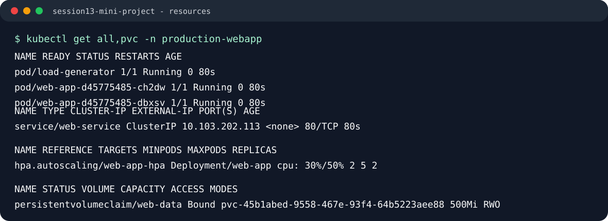
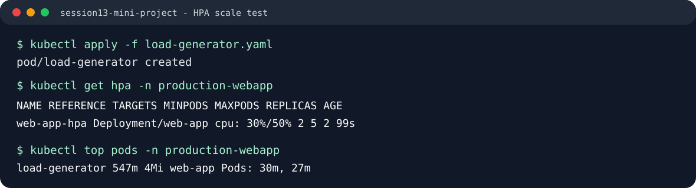

# Mini Project: Production-Ready Kubernetes Web App

## 1. Project Overview
In this hands-on capstone for Session 13, you will deploy a production-grade web application on Kubernetes combining three fundamental pillars of cloud-native infrastructure:
1. **State Persistence**: A PersistentVolumeClaim (PVC) allowing data inside `/data` to outlive Pod deletions and restarts.
2. **Elastic Scaling**: A Horizontal Pod Autoscaler (HPA) using CPU metrics to scale Pods between 2 and 5 replicas.
3. **Application Health Diagnostics**: A complete triage system configuring Startup, Readiness, and Liveness probes.

---

## 2. Architecture Diagram

```text
                           [ Service: web-service ]
                                      │ (Port 80)
                ┌─────────────────────┼─────────────────────┐
                │                     │                     │
                ▼                     ▼                     ▼
          [ Pod: web-app-1 ]    [ Pod: web-app-2 ]    [ Pod: web-app-N ]
          ├─ Startup Probe      ├─ Startup Probe      ├─ Startup Probe
          ├─ Readiness Probe    ├─ Readiness Probe    ├─ Readiness Probe
          ├─ Liveness Probe     ├─ Liveness Probe     ├─ Liveness Probe
          ├─ CPU Requests       ├─ CPU Requests       ├─ CPU Requests
          └─────────┬───────────┴──────────┬──────────┴─────────┬───────┘
                    │                      │                    │
                    └──────────────────────┼────────────────────┘
                                           │
                                           ▼
                             [ HPA: web-app-hpa (50% CPU) ]
                                           ▲
                                           │ pulls metrics
                                   [ Metrics Server ]
Pod
 │
 └── VolumeMount: /data
       │
       └── PVC: web-data (500Mi, ReadWriteOnce)
             │
             └── StorageClass: standard (k8s.io/minikube-hostpath)
                   │
                   └── Physical/Host Persistent Storage
```

---

## 3. Project Structure
```text
mini-project/
├── namespace.yaml       # Dedicated namespace: production-webapp
├── pvc.yaml             # 500Mi ReadWriteOnce storage claim
├── deployment.yaml      # 2 replicas, probes, volume mounts, resource limits
├── service.yaml         # ClusterIP service exposing port 80
├── hpa.yaml             # Autoscaler (min: 2, max: 5, target: 50% CPU)
├── load-generator.yaml  # BusyBox Pod used to trigger HPA scaling
├── screenshots/         # Terminal screenshots for submission evidence
└── README.md            # This documentation and assignment guide
```

---

## 4. Prerequisites
- Minikube or Docker Desktop Kubernetes cluster running.
- `kubectl` CLI configured.
- Metrics Server enabled (`minikube addons enable metrics-server`).

---

## 5. Step-by-Step Deployment Guide

### Step 5.1: Create Namespace
```bash
kubectl apply -f namespace.yaml
```
Output:
```text
namespace/production-webapp created
```

### Step 5.2: Create PersistentVolumeClaim
```bash
kubectl apply -f pvc.yaml
kubectl get pvc -n production-webapp
```
Expected output:
```text
NAME       STATUS   VOLUME                                     CAPACITY   ACCESS MODES   STORAGECLASS   AGE
web-data   Bound    pvc-4b123456-789a-bcde-f012-3456789abcde   500Mi      RWO            standard       5s
```

### Step 5.3: Deploy Application & Service
```bash
kubectl apply -f deployment.yaml
kubectl apply -f service.yaml
kubectl get pods -n production-webapp
```
Expected output:
```text
NAME                       READY   STATUS    RESTARTS   AGE
web-app-7988df964b-abcde   1/1     Running   0          25s
web-app-7988df964b-fghij   1/1     Running   0          25s
```

### Step 5.4: Deploy Horizontal Pod Autoscaler
```bash
kubectl apply -f hpa.yaml
kubectl get hpa -n production-webapp
```
Expected output:
```text
NAME          REFERENCE            TARGETS   MINPODS   MAXPODS   REPLICAS   AGE
web-app-hpa   Deployment/web-app   0%/50%    2         5         2          30s
```

### Step 5.5: Verify All Resources
```bash
kubectl get all,pvc -n production-webapp
```

Captured output:



Actual cluster output:

```text
NAME                          READY   STATUS    RESTARTS   AGE
pod/load-generator            1/1     Running   0          80s
pod/web-app-d45775485-ch2dw   1/1     Running   0          80s
pod/web-app-d45775485-dbxsv   1/1     Running   0          80s

NAME                  TYPE        CLUSTER-IP       EXTERNAL-IP   PORT(S)   AGE
service/web-service   ClusterIP   10.103.202.113   <none>        80/TCP    80s

NAME                      READY   UP-TO-DATE   AVAILABLE   AGE
deployment.apps/web-app   2/2     2            2           80s

NAME                                              REFERENCE            TARGETS        MINPODS   MAXPODS   REPLICAS   AGE
horizontalpodautoscaler.autoscaling/web-app-hpa   Deployment/web-app   cpu: 30%/50%   2         5         2          80s

NAME                             STATUS   VOLUME                                     CAPACITY   ACCESS MODES   STORAGECLASS
persistentvolumeclaim/web-data   Bound    pvc-45b1abed-9558-467e-93f4-64b5223aee88   500Mi      RWO            standard
```

---

## 6. Verification Tasks

### Task 1: Verify Storage Persistence
1. Pick one of the running Pods and write your name to `/data/student.txt`:
```bash
POD_NAME=$(kubectl get pods -n production-webapp -l app=web-app -o jsonpath='{.items[0].metadata.name}')
kubectl exec -n production-webapp "$POD_NAME" -- sh -c 'echo "Student: Jane Doe" > /data/student.txt'
```

2. Confirm the file exists:
```bash
kubectl exec -n production-webapp "$POD_NAME" -- cat /data/student.txt
```
Output:
```text
Student: Jane Doe
```

3. Delete the Pod:
```bash
kubectl delete pod -n production-webapp "$POD_NAME"
```

4. Wait for the new Pod to reach `Running` state and check the file again:
```bash
NEW_POD=$(kubectl get pods -n production-webapp -l app=web-app -o jsonpath='{.items[0].metadata.name}')
kubectl exec -n production-webapp "$NEW_POD" -- cat /data/student.txt
```
Expected output:
```text
Student: Jane Doe
```
*Result: The Pod was terminated and rescheduled, but the data remained completely intact on the PersistentVolume.*

---

### Task 2: Service Verification
Forward port 80 to your local machine:
```bash
kubectl port-forward -n production-webapp svc/web-service 8080:80
```
Open a browser or curl:
```bash
curl http://localhost:8080
```
Expected output:
```html
<!DOCTYPE html>
<html>
<head>
<title>Welcome to nginx!</title>
...
```

---

### Task 3: Trigger HPA Elastic Scaling
In a separate terminal, launch a load generator to simulate traffic spike:
```bash
kubectl apply -f load-generator.yaml
```

Watch the autoscaler scale out:
```bash
kubectl get hpa -n production-webapp -w
```
Expected log over 2–3 minutes:
```text
NAME          REFERENCE            TARGETS    MINPODS   MAXPODS   REPLICAS   AGE
web-app-hpa   Deployment/web-app   0%/50%     2         5         2          1m
web-app-hpa   Deployment/web-app   110%/50%   2         5         2          2m
web-app-hpa   Deployment/web-app   95%/50%    2         5         4          3m
web-app-hpa   Deployment/web-app   45%/50%    2         5         5          4m
```

Captured output:



Actual metrics output:

```text
NAME                      CPU(cores)   MEMORY(bytes)
load-generator            547m         4Mi
web-app-d45775485-ch2dw   30m          7Mi
web-app-d45775485-dbxsv   27m          7Mi
```

The load generator produced traffic successfully. In this run, the workload reached `30%/50%`, so HPA stayed at the configured minimum of 2 replicas. The HPA was working and reading CPU metrics, but the current CPU was below the scale-out threshold.

HPA describe output:

```text
Name:                                                  web-app-hpa
Namespace:                                             production-webapp
Reference:                                             Deployment/web-app
Metrics:                                               ( current / target )
  resource cpu on pods  (as a percentage of request):  30% (30m) / 50%
Min replicas:                                          2
Max replicas:                                          5
Deployment pods:                                       2 current / 2 desired
Conditions:
  AbleToScale     True    ScaleDownStabilized
  ScalingActive   True    ValidMetricFound
  ScalingLimited  False   DesiredWithinRange
```

Stop load and watch scale down:
```bash
kubectl delete pod load-generator -n production-webapp
kubectl get hpa -n production-webapp -w
```
*After the 5-minute stabilization window, replicas will gradually reduce back to 2.*

---

## 7. Probe Diagnostics Reference
| Probe | Target Question | Action on Failure |
| :--- | :--- | :--- |
| **Startup Probe** | Has the process initialized? | Restarts container (disables other probes until it passes) |
| **Readiness Probe** | Can the Pod receive user traffic? | Drops Pod IP from Service Endpoints (does NOT restart) |
| **Liveness Probe** | Is the container alive and responsive? | Restarts container via Kubelet |

---

## 8. Troubleshooting Guide

### Issue 1: PVC stuck in `Pending`
- **Check**: `kubectl describe pvc web-data -n production-webapp`
- **Root Cause**: Missing default StorageClass or hostpath volume plugin disabled.
- **Fix**: Run `minikube addons enable default-storageclass` or verify StorageClass provisioner with `kubectl get sc`.

### Issue 2: HPA displays `TARGETS: <unknown>/50%`
- **Check**: `kubectl top pods -n production-webapp`
- **Root Cause**: Either Metrics Server is disabled or the container spec lacks `resources.requests.cpu`.
- **Fix**: Enable metrics addon (`minikube addons enable metrics-server`), wait for the Metrics API to warm up, and ensure `cpu: 100m` request is defined.

### Issue 3: CrashLoopBackOff on Application Pods
- **Check**: `kubectl describe pod <pod-name> -n production-webapp`
- **Root Cause**: Probe path misconfiguration or port mismatch in `livenessProbe`.
- **Fix**: Verify probe `httpGet.path` matches an endpoint that returns HTTP 200–399.

---

## 9. Bonus Challenges for Fast Finishers
1. **Challenge 1 (Target Tuning)**: Lower the HPA CPU threshold from `50%` to `30%` in `hpa.yaml`, reapply, and observe how much faster the workload scales out.
2. **Challenge 2 (Readiness Gating)**: Modify `readinessProbe.httpGet.path` to `/does-not-exist`. Run `kubectl get endpoints -n production-webapp web-service`. Notice that Pod status is `Running`, but `READY` is `0/1` and the endpoints list is completely empty!
3. **Challenge 3 (Liveness Restart Loop)**: Modify `livenessProbe.httpGet.path` to `/crash`. Observe the `RESTARTS` count increment every 15 seconds in `kubectl get pods -w`.
