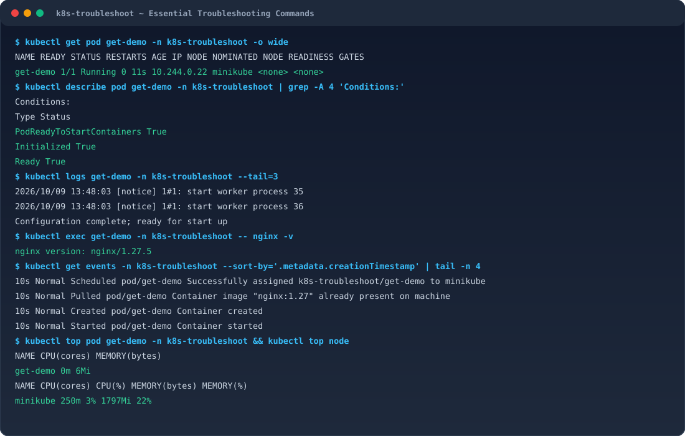
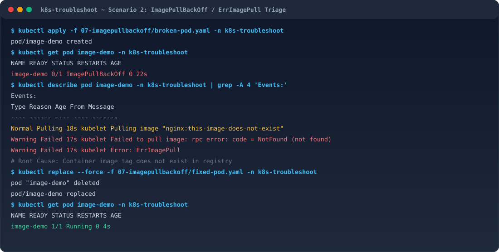
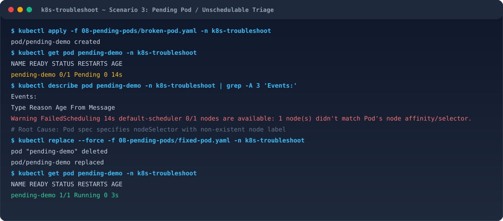
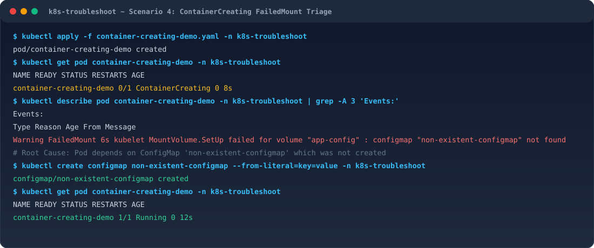
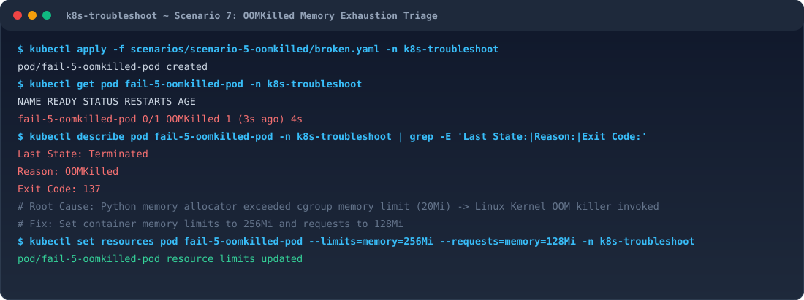
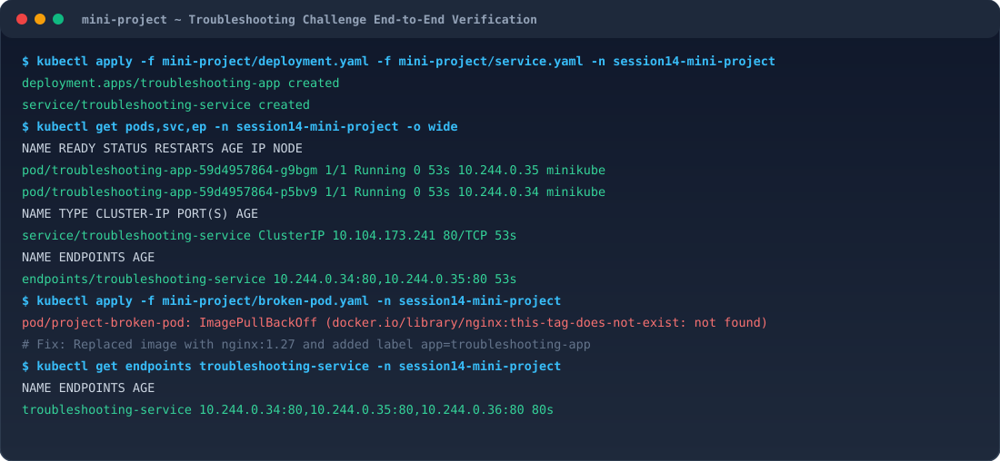

# Session 14: Kubernetes Troubleshooting — Final Submission

## Overview
This document contains the complete solutions, terminal investigations, root cause analyses, fixes, verification proofs, and visual evidence for **Session 14: Kubernetes Troubleshooting**.

---

## Task 1: Kubernetes Troubleshooting Commands

### 1. `kubectl get`
Retrieves a list of resources and high-level health state (`READY`, `STATUS`, `RESTARTS`, `AGE`).
```bash
kubectl get pods
kubectl get svc,ep
kubectl get pods -o wide
kubectl get pods --show-labels
```
* **Sample Real Output:**
```text
NAME       READY   STATUS    RESTARTS   AGE   IP            NODE       NOMINATED NODE   READINESS GATES
get-demo   1/1     Running   0          11s   10.244.0.22   minikube   <none>           <none>
```

### 2. `kubectl describe`
Inspects in-depth metadata, pod conditions, container state, exit codes, restart history, and live controller events.
```bash
kubectl describe pod get-demo
```
* **Key Sections Examined:**
  - `Conditions`: `PodReadyToStartContainers`, `Initialized`, `Ready`, `ContainersReady`, `PodScheduled`.
  - `Containers State`: `Running`, `Waiting`, or `Terminated` (with exit code & reason).
  - `Events`: Chronological list of scheduling, pulling, creation, and probe failure events.

### 3. `kubectl logs`
Streams container stdout/stderr. Used to catch application exceptions, stack traces, and unhandled errors.
```bash
kubectl logs get-demo --tail=10
kubectl logs get-demo --previous   # Crucial for CrashLoopBackOff: inspects previous dead container
kubectl logs <pod> -c <container>  # Multi-container pods
```

### 4. `kubectl exec`
Runs diagnostic commands inside a live container or opens an interactive debugging shell.
```bash
kubectl exec -it get-demo -- /bin/sh
kubectl exec get-demo -- nginx -v
kubectl exec get-demo -- curl -s localhost:80
```

### 5. `kubectl events` / `kubectl get events`
Captures cluster-wide event notifications, scheduler actions, volume mount failures, and kubelet restarts.
```bash
kubectl get events --sort-by='.metadata.creationTimestamp'
```

### 6. `kubectl explain`
Interactive API documentation built into the CLI for exploring field hierarchies and configurations.
```bash
kubectl explain pod.spec.containers.resources
kubectl explain service.spec
```

### 7. `kubectl top`
Displays real-time CPU and memory consumption for nodes and pods (requires Metrics Server).
```bash
kubectl top nodes
kubectl top pods
kubectl top pods --containers
```
* **Real Output:**
```text
NAME       CPU(cores)   MEMORY(bytes)   
get-demo   0m           6Mi             
NAME       CPU(cores)   CPU(%)   MEMORY(bytes)   MEMORY(%)   
minikube   250m         3%       1797Mi          22%         
```

### 8. `kubectl get -o wide`
Expands the standard table output to include Pod IP addresses, Node assignments, and readiness gates.

### Task 1 Evidence & Terminal Output


---

## Task 2: Troubleshoot Common Issues

---

### Issue 1: `CrashLoopBackOff`
* **Problem Statement**: Pod repeatedly terminates immediately upon start, enters restart backoff loop.
* **Investigation**:
  1. `kubectl get pod crash-demo` shows `STATUS: CrashLoopBackOff` with incrementing restarts.
  2. `kubectl logs crash-demo --previous` displays:
     ```text
     Application starting...
     Something went wrong!
     ```
  3. `kubectl describe pod crash-demo` indicates `Last State: Terminated, Exit Code: 1, Reason: Error`.
* **Root Cause**: The container's entrypoint command executed `exit 1`, causing the process to fail immediately.
* **Fix**: Update the command to a persistent, healthy foreground process (`sleep 3600`).
* **Verification**: `kubectl get pod crash-demo` transitions to `Running (1/1)` with 0 restarts.


---

### Issue 2: `ImagePullBackOff` & `ErrImagePull`
* **Problem Statement**: Pod is stuck and unable to pull its specified container image.
* **Investigation**:
  1. `kubectl get pod image-demo` displays `STATUS: ErrImagePull` then `STATUS: ImagePullBackOff`.
  2. `kubectl describe pod image-demo` reveals:
     ```text
     Warning  Failed   kubelet   Failed to pull image "nginx:this-image-does-not-exist": rpc error: code = NotFound
     Warning  Failed   kubelet   Error: ErrImagePull
     ```
* **Root Cause**: The image tag `this-image-does-not-exist` does not exist in Docker Hub / registry.
* **Fix**: Correct the image reference to a valid tag `nginx:1.27`.
* **Verification**: Kubelet successfully pulls the image; pod transitions to `Running (1/1)`.



---

### Issue 3: `Pending` Pods (Scheduling Failure)
* **Problem Statement**: Pod remains stuck in `Pending` state and is never assigned to any worker node.
* **Investigation**:
  1. `kubectl get pod pending-demo` reports `STATUS: Pending`.
  2. `kubectl describe pod pending-demo` Events section indicates:
     ```text
     Warning  FailedScheduling  default-scheduler  0/1 nodes are available: 1 node(s) didn't match Pod's node affinity/selector.
     ```
* **Root Cause**: `nodeSelector: kubernetes.io/hostname: node-that-does-not-exist` requested a node label that exists nowhere in the cluster.
* **Fix**: Remove the invalid `nodeSelector` constraint or adjust resource requests to fit available capacity.
* **Verification**: Default scheduler immediately binds the pod to `minikube`; status becomes `Running`.



---

### Issue 4: `ContainerCreating` (Volume / ConfigMap Missing)
* **Problem Statement**: Pod is stuck in `ContainerCreating` indefinitely and never starts.
* **Investigation**:
  1. `kubectl get pod container-creating-demo` shows `STATUS: ContainerCreating`.
  2. `kubectl describe pod container-creating-demo` Events section indicates:
     ```text
     Warning  FailedMount  kubelet  MountVolume.SetUp failed for volume "app-config" : configmap "non-existent-configmap" not found
     ```
* **Root Cause**: Pod volume definition references a ConfigMap that does not exist in the namespace.
* **Fix**: Create the required ConfigMap `kubectl create configmap non-existent-configmap --from-literal=key=value`.
* **Verification**: Volume mounts cleanly and pod status transitions to `Running (1/1)`.



---

### Issue 5 & 6: Service Connectivity & DNS Resolution Issues
* **Problem Statement**: Internal cluster clients cannot reach the web service either by service name or ClusterIP; requests time out.
* **Investigation**:
  1. `kubectl get svc broken-service` shows valid ClusterIP `10.103.9.8`.
  2. `kubectl get endpoints broken-service` reveals `ENDPOINTS: <none>`.
  3. `kubectl describe svc broken-service` displays `Selector: app=does-not-exist`.
  4. `kubectl get pods --show-labels` shows the backing pods have label `app=web`.
  5. DNS lookup from test pod `nslookup web-service` verifies CoreDNS returns the Service ClusterIP once selector matches.
* **Root Cause**: Service selector mismatch (`app=does-not-exist` vs Pod label `app=web`).
* **Fix**: Update the Service spec selector to `app: web`.
* **Verification**: `kubectl get endpoints web-service` shows Pod IPs (`10.244.0.29:80, 10.244.0.30:80`). `wget -qO- http://web-service:80` returns the HTTP 200 Nginx welcome page.


---

### Issue 7: Pod Networking (Port vs TargetPort Mismatch)
* **Problem Statement**: Service endpoints exist, but connections to the Service port fail with `Connection refused`.
* **Investigation**:
  1. Inspect Service: `kubectl describe svc web-service` -> `Port: 80, TargetPort: 8080`.
  2. Inspect Pod: `kubectl describe pod <pod-name>` -> container is listening on port `80`.
* **Root Cause**: Service `targetPort` forwarded traffic to port 8080, where nothing was listening.
* **Fix**: Update Service `targetPort` to `80`.
* **Verification**: Traffic successfully routes to the container process.

---

### Issue 8: Configuration / OOMKilled (Exit Code 137)
* **Problem Statement**: Pod starts, executes briefly, and abruptly crashes with `OOMKilled`.
* **Investigation**:
  1. `kubectl get pod fail-5-oomkilled-pod` shows `STATUS: OOMKilled`.
  2. `kubectl describe pod fail-5-oomkilled-pod` reports:
     ```text
     Last State:     Terminated
       Reason:       OOMKilled
       Exit Code:    137
     ```
* **Root Cause**: The application memory allocation exceeded the container's cgroup memory limit (`limits.memory: 20Mi`). The Linux kernel invoked the OOM killer to terminate the process.
* **Fix**: Adjust container memory limits (`limits.memory: 256Mi`, `requests.memory: 128Mi`).
* **Verification**: Pod runs stably without hitting cgroup memory ceilings.



---

## Task 3: Mini Project — Troubleshooting Challenge

### Architecture
```text
                    Kubernetes Cluster
                             │
                             ▼
                   ┌───────────────────┐
                   │      Service      │
                   │ (ClusterIP: 80)   │
                   └─────────┬─────────┘
                             │
                      Service Selector
                   (app: troubleshooting-app)
                             │
              ┌──────────────┴──────────────┐
              │                             │
              ▼                             ▼
    Pod 1 (10.244.0.34:80)        Pod 2 (10.244.0.35:80)
              │                             │
              └──────────────┬──────────────┘
                             │
                         Nginx App
```

### Step 1: Initial Deployment & Verification
```bash
kubectl apply -f deployment.yaml
kubectl apply -f service.yaml
```
* **Pods Status**:
```text
NAME                                   READY   STATUS    RESTARTS   AGE   IP            NODE
troubleshooting-app-59d4957864-g9bgm   1/1     Running   0          53s   10.244.0.35   minikube
troubleshooting-app-59d4957864-p5bv9   1/1     Running   0          53s   10.244.0.34   minikube
```
* **Service & Endpoints**:
```text
NAME                      TYPE        CLUSTER-IP       PORT(S)   AGE   ENDPOINTS
troubleshooting-service   ClusterIP   10.104.173.241   80/TCP    53s   10.244.0.34:80,10.244.0.35:80
```

---

### Step 2: Broken Pod Investigation (`project-broken-pod`)
```bash
kubectl apply -f broken-pod.yaml
kubectl get pod project-broken-pod
kubectl describe pod project-broken-pod
```

#### Mini-Project Section 7 Questions & Answers:
* **Question 1: What is the Pod status?**
  * **Answer:** `ImagePullBackOff` (initially `ErrImagePull`).
* **Question 2: What is the actual error?**
  * **Answer:** `Failed to pull image "nginx:this-tag-does-not-exist": rpc error: code = NotFound desc = failed to pull and unpack image "docker.io/library/nginx:this-tag-does-not-exist": not found`.
* **Question 3: Which command helped you find the reason?**
  * **Answer:** `kubectl describe pod project-broken-pod` under the **Events** section.
* **Question 4: What is wrong with the image?**
  * **Answer:** The tag `this-tag-does-not-exist` does not exist in the Docker Hub registry for `nginx`.
* **Question 5: How would you fix it?**
  * **Answer:** Update the image field in `broken-pod.yaml` to a valid tag (such as `nginx:1.27` or `nginx:alpine`) and apply the fix.

---

### Step 3: Service Selector Troubleshooting Challenge
1. Changed selector in `service.yaml` to `app: wrong-app`.
2. Applied change: `kubectl get endpoints troubleshooting-service` returned `<none>`.
3. Checked labels: `kubectl get pods --show-labels` confirmed pods have `app=troubleshooting-app`.
4. Root cause: Selector mismatch.
5. Restored selector to `app: troubleshooting-app`.
6. Verified endpoints returned: `10.244.0.34:80, 10.244.0.35:80`.

### Mini Project Evidence & Terminal Output


---

## Mini-Project Section 11: Troubleshooting Table

| Problem | What I Saw | Command I Used | Root Cause | Fix |
| :--- | :--- | :--- | :--- | :--- |
| **Broken Pod** | Pod stuck in `ImagePullBackOff` / `ErrImagePull` | `kubectl get pods`, `kubectl describe pod project-broken-pod` | Image tag `nginx:this-tag-does-not-exist` does not exist in registry | Change image to valid tag `nginx:1.27` |
| **Service Problem** | Endpoints were `<none>`, ClusterIP not routing | `kubectl get endpoints`, `kubectl describe svc`, `kubectl get pods --show-labels` | Service selector `app=wrong-app` did not match Pod label `app=troubleshooting-app` | Update Service selector to `app: troubleshooting-app` |
| **CrashLoop Problem** | Pod crashing with `CrashLoopBackOff`, restarts increasing | `kubectl logs <pod> --previous`, `kubectl describe pod` | Application entrypoint script executed `exit 1` | Correct container command / script logic to run stably |
| **Pending Pod** | Pod remained `Pending`, not assigned to any node | `kubectl describe pod <pod>` (Events) | `nodeSelector` matched no node labels or insufficient CPU/RAM | Fix `nodeSelector` or adjust resource requests |
| **ContainerCreating** | Stuck in `ContainerCreating` with `FailedMount` | `kubectl describe pod <pod>` | Volume mounted a non-existent ConfigMap/Secret | Create missing ConfigMap or Secret |

---

## Mini-Project Section 12: Conceptual README Questions

### 1. What does `kubectl get` tell us?
`kubectl get` provides a high-level summary list of Kubernetes resources in the cluster or namespace. It shows basic metadata including resource names, readiness ratio (`READY 1/1`), lifecycle status (`Running`, `Pending`, `CrashLoopBackOff`), restart counts, and uptime. With `-o wide`, it also reveals internal Pod IPs and assigned Nodes.

### 2. What is the difference between `get` and `describe`?
* `kubectl get` gives a concise tabular overview of one or many resources.
* `kubectl describe` provides an exhaustive, detailed breakdown of a single resource, including its full specification, node assignment, container states (current and previous termination reasons/exit codes), mount points, resource limits, and real-time controller Events.

### 3. Why do we use `kubectl logs`?
We use `kubectl logs` to inspect standard output (`stdout`) and standard error (`stderr`) emitted by the application process inside a container. It is the primary tool for diagnosing application-level errors, runtime exceptions, syntax errors, and database connection timeouts. With the `--previous` flag, it retrieves logs from the previously crashed container instance.

### 4. When would you use `kubectl exec`?
You use `kubectl exec` when you need to run diagnostic commands directly inside the container environment. Typical use cases include testing network reachability from inside the pod (`curl`, `nc`, `ping`), querying DNS resolution (`nslookup`), inspecting filesystem contents, verifying environment variables (`env`), and checking local config files.

### 5. What does `CrashLoopBackOff` mean?
`CrashLoopBackOff` means that a container started, exited (usually with a non-zero exit code or sudden termination), and Kubernetes restarted it according to the `restartPolicy`. Because it repeatedly crashed, the kubelet entered an exponential backoff delay (10s, 20s, 40s... up to 5 minutes) before attempting the next restart to avoid saturating node resources.

### 6. What does `ImagePullBackOff` mean?
`ImagePullBackOff` indicates that the kubelet failed to pull the container image from the container registry (due to an invalid tag, mistyped repository name, missing authentication credentials for private registries, or network failure), and is now waiting in an exponential backoff loop before retrying the pull.

### 7. Why can a Pod remain `Pending`?
A Pod remains in `Pending` when the Kubernetes `default-scheduler` cannot find a suitable node to place the pod on. Common reasons include:
1. **Resource Insufficiency**: Nodes lack sufficient unallocated CPU or Memory requests.
2. **Node Affinity / NodeSelector**: Pod specifies labels that match 0 nodes.
3. **Taints and Tolerations**: Nodes have taints that the pod does not tolerate.
4. **PersistentVolume Claim**: PVC required by the pod is unbound.

### 8. Why can a Service have no endpoints?
A Service has no endpoints (`<none>`) when:
1. The Service `spec.selector` key-value pairs do not match the `metadata.labels` on any running Pod.
2. The matching Pods are not in a `Ready` state (e.g., readiness probe failing or pod crashing).
3. The backing Pods are in a different namespace than the Service.

### 9. What is the relationship between a Service selector and Pod labels?
Kubernetes uses loose coupling via **Label Selectors**. A Service defines a `selector` map. The Kubernetes Endpoint/EndpointSlice controller continuously scans all Pods in the same namespace; any Pod whose labels match all key-value pairs in the Service selector is automatically registered as a backend IP:port endpoint for that Service.

### 10. What is Kubernetes DNS?
Kubernetes DNS (CoreDNS) is a built-in cluster add-on that automatically creates DNS records for Services and Pods. It enables service discovery by allowing containers to address services by hostname (e.g., `web-service` or `web-service.namespace.svc.cluster.local`) rather than needing hardcoded IP addresses. CoreDNS dynamically resolves these names to the current Service ClusterIP.

---

## Troubleshooting Methodology Reference
```text
1. OBSERVE      ──>  kubectl get pods -o wide
2. IDENTIFY     ──>  Pinpoint failing pod / service / resource
3. DESCRIBE     ──>  kubectl describe <resource> <name>
4. EVENTS       ──>  Check controller & kubelet events
5. LOGS         ──>  kubectl logs <pod> (--previous if restarting)
6. EXEC/DEBUG   ──>  kubectl exec -it <pod> -- sh / nslookup / curl
7. ROOT CAUSE   ──>  Identify exact code, spec, or network fault
8. FIX          ──>  Update YAML spec / container configuration
9. VERIFY       ──>  Confirm status transitions to Running (1/1) & endpoints populated
```
