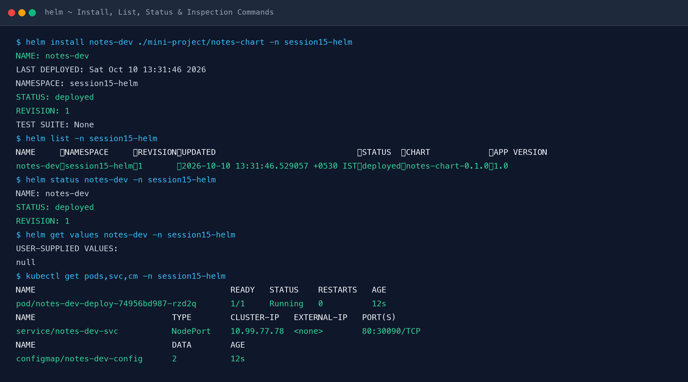
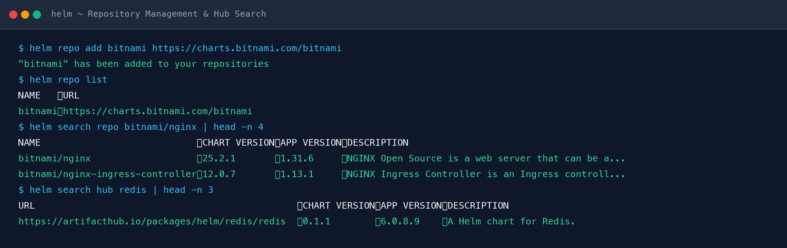
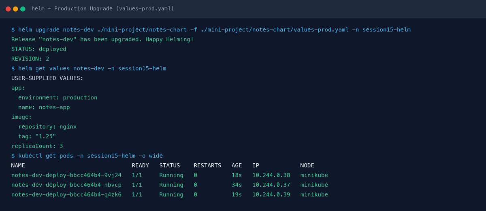
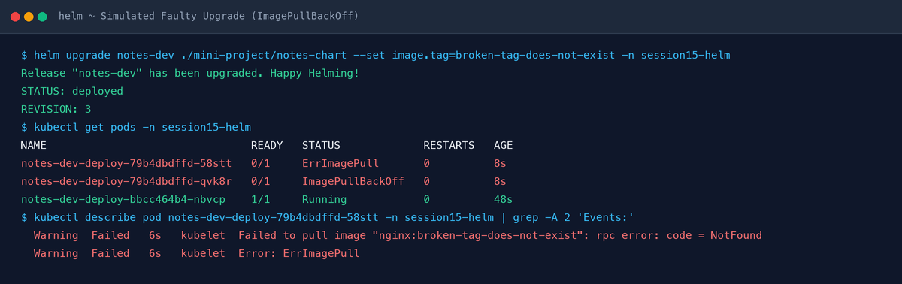
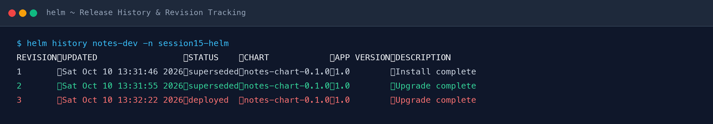
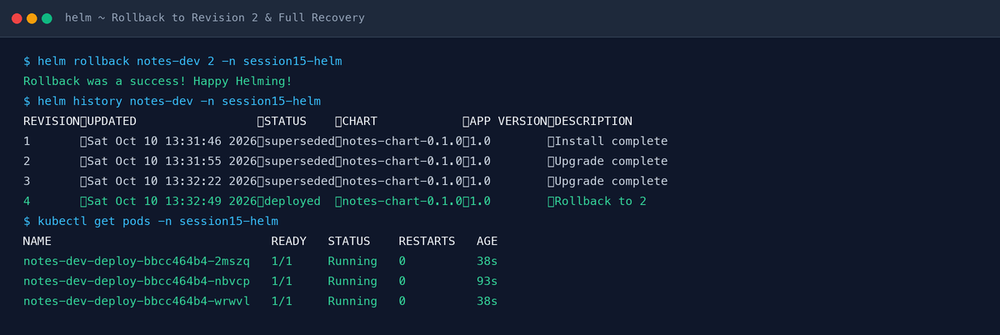
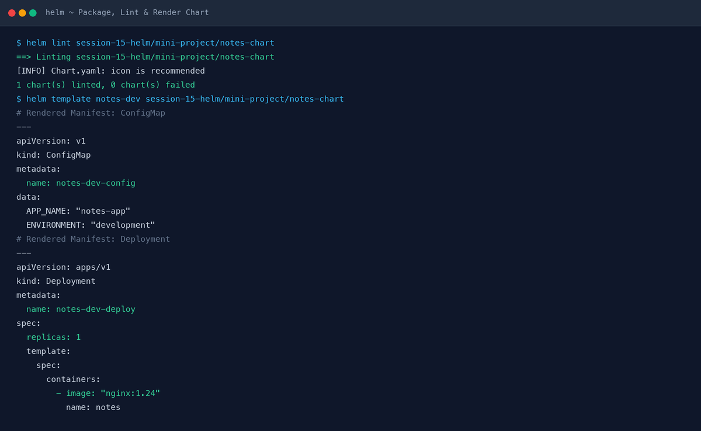
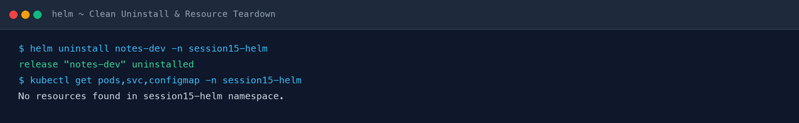

# Session 15: Helm — Final Submission

## Overview
This document contains the complete deliverables, real terminal outputs, chart definitions, template evaluations, upgrade/rollback lifecycle documentation, and PNG screenshots for **Session 15: Helm**.

---

## Task 1: Essential Helm Commands

### 1. `helm create`
Creates a standardized chart directory structure containing `Chart.yaml`, `values.yaml`, `.helmignore`, `charts/`, and `templates/` (with default deployment, service, ingress, and helper templates).
```bash
helm create my-chart
```
* **What it does:** Scaffolds a production-ready boilerplate chart following official Helm best practices.

---

### 2. `helm install`
Packages and deploys a Helm chart onto a target Kubernetes cluster, creating a new release.
```bash
helm install notes-dev ./mini-project/notes-chart -n session15-helm
```
* **Real Output:**
```text
NAME: notes-dev
LAST DEPLOYED: Sat Oct 10 13:31:46 2026
NAMESPACE: session15-helm
STATUS: deployed
REVISION: 1
TEST SUITE: None
```
* **What it does:** Renders templates with values, submits manifests to the Kubernetes API server, and tracks release metadata in cluster secrets.

---

### 3. `helm list` (`helm ls`)
Lists all releases deployed in a specific namespace (or cluster-wide with `-A`).
```bash
helm list -n session15-helm
```
* **Real Output:**
```text
NAME     	NAMESPACE     	REVISION	UPDATED                             	STATUS  	CHART            	APP VERSION
notes-dev	session15-helm	1       	2026-10-10 13:31:46.529057 +0530 IST	deployed	notes-chart-0.1.0	1.0        
```
* **What it does:** Queries the release storage backend to display release name, namespace, revision number, status, chart version, and application version.

---

### 4. `helm status`
Shows detailed status and information for a given release.
```bash
helm status notes-dev -n session15-helm
```
* **What it does:** Displays last deployment timestamp, namespace, release status (`deployed`, `failed`, `superseded`), and rendered release notes.

---

### 5. `helm get`
Fetches extended information about a release from cluster storage.
```bash
helm get values notes-dev -n session15-helm     # Retrieves user-supplied values
helm get manifest notes-dev -n session15-helm   # Retrieves generated Kubernetes YAML manifests
helm get all notes-dev -n session15-helm        # Retrieves all release artifacts
```
* **Real Output (`helm get values`):**
```text
USER-SUPPLIED VALUES:
app:
  environment: production
  name: notes-app
image:
  repository: nginx
  tag: "1.25"
replicaCount: 3
```
* **What it does:** Decodes the release secret in the cluster and prints the specific requested metadata.

---

### 6. `helm upgrade`
Upgrades an existing release to a new chart version or applies new values/configurations.
```bash
helm upgrade notes-dev ./mini-project/notes-chart -f ./mini-project/notes-chart/values-prod.yaml -n session15-helm
```
* **Real Output:**
```text
Release "notes-dev" has been upgraded. Happy Helming!
NAME: notes-dev
LAST DEPLOYED: Sat Oct 10 13:31:55 2026
NAMESPACE: session15-helm
STATUS: deployed
REVISION: 2
TEST SUITE: None
```
* **What it does:** Computes the three-way merge patch between previous release, new chart/values, and live cluster state, incrementing the release revision.

---

### 7. `helm history`
Displays the full revision history of a release.
```bash
helm history notes-dev -n session15-helm
```
* **Real Output:**
```text
REVISION	UPDATED                 	STATUS    	CHART            	APP VERSION	DESCRIPTION     
1       	Sat Oct 10 13:31:46 2026	superseded	notes-chart-0.1.0	1.0        	Install complete
2       	Sat Oct 10 13:31:55 2026	superseded	notes-chart-0.1.0	1.0        	Upgrade complete
3       	Sat Oct 10 13:32:22 2026	superseded	notes-chart-0.1.0	1.0        	Upgrade complete
4       	Sat Oct 10 13:32:49 2026	deployed  	notes-chart-0.1.0	1.0        	Rollback to 2   
```
* **What it does:** Inspects historical release secrets stored in the namespace and presents a chronological audit log of all changes.

---

### 8. `helm rollback`
Rolls back a release to a previous stable revision.
```bash
helm rollback notes-dev 2 -n session15-helm
```
* **Real Output:**
```text
Rollback was a success! Happy Helming!
```
* **What it does:** Reapplies the manifests and values from the targeted historical revision as a new release revision, ensuring atomic recovery.

---

### 9. `helm uninstall`
Completely removes a release and all of its associated Kubernetes resources.
```bash
helm uninstall notes-dev -n session15-helm
```
* **Real Output:**
```text
release "notes-dev" uninstalled
```
* **What it does:** Deletes Deployments, Services, ConfigMaps, and the release tracking secrets from Kubernetes.

---

### 10. `helm repo`
Manages external chart repositories (adding, listing, updating).
```bash
helm repo add bitnami https://charts.bitnami.com/bitnami
helm repo list
helm repo update
```
* **Real Output:**
```text
"bitnami" has been added to your repositories
NAME   	URL                               
bitnami	https://charts.bitnami.com/bitnami
```

---

### 11. `helm search`
Searches for published charts locally in configured repositories or globally on Artifact Hub.
```bash
helm search repo bitnami/nginx
helm search hub redis
```
* **Real Output:**
```text
NAME                            	CHART VERSION	APP VERSION	DESCRIPTION                                       
bitnami/nginx                   	25.2.1       	1.31.6     	NGINX Open Source is a web server that can be a...
bitnami/nginx-ingress-controller	12.0.7       	1.13.1     	NGINX Ingress Controller is an Ingress controll...
```

### Task 1 Evidence & Screenshots



---

## Task 2: Helm Rollback Lifecycle

```text
  [ Revision 1: Dev Install ]
   • 1 Replica, nginx:1.24
   • Status: Deployed
               │
               ▼
  [ Revision 2: Prod Upgrade ]
   • 3 Replicas, nginx:1.25
   • Status: Deployed (Rev 1 superseded)
               │
               ▼
  [ Revision 3: Bad Upgrade ]
   • Broken Tag: image.tag=broken-tag-does-not-exist
   • Status: ImagePullBackOff / ErrImagePull
               │
               ▼
  [ Revision 4: Helm Rollback to Rev 2 ]
   • Command: helm rollback notes-dev 2
   • Status: Deployed (Restores 3 healthy pods with nginx:1.25)
```

### Complete Step-by-Step Workflow & Evidence:

1. **Initial Deployment (Revision 1)**:
   ```bash
   helm install notes-dev ./mini-project/notes-chart -n session15-helm
   ```
   *Pod Status:* 1 replica running (`notes-dev-deploy-74956bd987-rzd2q` - 1/1 Running).

2. **Production Upgrade (Revision 2)**:
   ```bash
   helm upgrade notes-dev ./mini-project/notes-chart -f ./mini-project/notes-chart/values-prod.yaml -n session15-helm
   ```
   *Pod Status:* Scaled to 3 replicas with `nginx:1.25` (`notes-dev-deploy-bbcc464b4-9vj24`, `notes-dev-deploy-bbcc464b4-nbvcp`, `notes-dev-deploy-bbcc464b4-q4zk6` - all 1/1 Running).
   

3. **Simulated Bad Upgrade (Revision 3)**:
   ```bash
   helm upgrade notes-dev ./mini-project/notes-chart --set image.tag=broken-tag-does-not-exist -n session15-helm
   ```
   *Pod Status:* New pods fail with `ErrImagePull` / `ImagePullBackOff`.
   

4. **Audit History**:
   ```bash
   helm history notes-dev -n session15-helm
   ```
   

5. **Rollback Execution (Revision 4)**:
   ```bash
   helm rollback notes-dev 2 -n session15-helm
   ```
   *Verification:*
   ```bash
   kubectl get pods -n session15-helm
   ```
   All 3 production pods restored and verified healthy (`1/1 Running`).
   

---

## Task 3: Mini Project — Notes App Helm Chart

### Directory Structure
```text
notes-chart/
├── Chart.yaml
├── values.yaml
├── values-prod.yaml
└── templates/
    ├── configmap.yaml
    ├── deployment.yaml
    └── service.yaml
```

---

### Chart Files & Manifests

#### 1. `Chart.yaml`
```yaml
apiVersion: v2
name: notes-chart
description: A simple Notes application Helm chart
type: application
version: 0.1.0
appVersion: "1.0"
```

#### 2. `values.yaml` (Development)
```yaml
replicaCount: 1

image:
  repository: nginx
  tag: "1.24"

service:
  port: 80
  nodePort: 30090

app:
  name: notes-app
  environment: development
```

#### 3. `values-prod.yaml` (Production)
```yaml
replicaCount: 3

image:
  repository: nginx
  tag: "1.25"

service:
  port: 80
  nodePort: 30090

app:
  name: notes-app
  environment: production
```

#### 4. `templates/configmap.yaml`
```yaml
apiVersion: v1
kind: ConfigMap
metadata:
  name: {{ .Release.Name }}-config
data:
  APP_NAME: {{ .Values.app.name | quote }}
  ENVIRONMENT: {{ .Values.app.environment | quote }}
```

#### 5. `templates/deployment.yaml`
```yaml
apiVersion: apps/v1
kind: Deployment
metadata:
  name: {{ .Release.Name }}-deploy
  labels:
    app: {{ .Release.Name }}
    environment: {{ .Values.app.environment }}
spec:
  replicas: {{ .Values.replicaCount }}
  selector:
    matchLabels:
      app: {{ .Release.Name }}
  template:
    metadata:
      labels:
        app: {{ .Release.Name }}
    spec:
      containers:
        - name: notes
          image: "{{ .Values.image.repository }}:{{ .Values.image.tag }}"
          ports:
            - containerPort: {{ .Values.service.port }}
          envFrom:
            - configMapRef:
                name: {{ .Release.Name }}-config
```

#### 6. `templates/service.yaml`
```yaml
apiVersion: v1
kind: Service
metadata:
  name: {{ .Release.Name }}-svc
spec:
  type: NodePort
  selector:
    app: {{ .Release.Name }}
  ports:
    - port: {{ .Values.service.port }}
      targetPort: {{ .Values.service.port }}
      nodePort: {{ .Values.service.nodePort }}
```

---

### Linting and Template Rendering
1. **Linting Check:**
   ```bash
   helm lint session-15-helm/mini-project/notes-chart
   ```
   *Result:*
   ```text
   ==> Linting session-15-helm/mini-project/notes-chart
   [INFO] Chart.yaml: icon is recommended
   1 chart(s) linted, 0 chart(s) failed
   ```

2. **Template Local Dry-Run:**
   ```bash
   helm template notes-dev session-15-helm/mini-project/notes-chart
   ```
   *Result:* All variables and templated expressions rendered into valid Kubernetes YAML (ConfigMap, Service, Deployment).



---

### Step-by-Step Mini-Project Lifecycle Walkthrough

#### Step 1–7: Chart Scaffold & Manifest Creation
* Created `notes-chart/Chart.yaml` defining metadata and versioning (`0.1.0`).
* Configured `values.yaml` (development baseline: 1 replica, `nginx:1.24`) and `values-prod.yaml` (production: 3 replicas, `nginx:1.25`).
* Implemented parameterized templates for `configmap.yaml`, `deployment.yaml`, and `service.yaml`.

#### Step 8–10: Lint, Render & Development Installation
```bash
helm install notes-dev ./mini-project/notes-chart -n session15-helm
```
* **Output:**
```text
NAME: notes-dev
LAST DEPLOYED: Sat Oct 10 13:31:46 2026
NAMESPACE: session15-helm
STATUS: deployed
REVISION: 1
```
* **Verification:**
```bash
kubectl get pods,svc,configmap -n session15-helm
```
* 1 Pod running (`notes-dev-deploy-74956bd987-rzd2q` - 1/1 Running)
* Service active on NodePort `80:30090/TCP`
* ConfigMap `notes-dev-config` with `APP_NAME="notes-app"` and `ENVIRONMENT="development"`.


#### Step 11–12: Production Upgrade & History Inspection
```bash
helm upgrade notes-dev ./mini-project/notes-chart -f ./mini-project/notes-chart/values-prod.yaml -n session15-helm
```
* **Output:** `Release "notes-dev" has been upgraded. STATUS: deployed, REVISION: 2`.
* **Verification:** 3 Pods running with `nginx:1.25` across the cluster (`notes-dev-deploy-bbcc464b4-9vj24`, `notes-dev-deploy-bbcc464b4-nbvcp`, `notes-dev-deploy-bbcc464b4-q4zk6`).


#### Step 13: Fault Injection (Bad Image Tag)
```bash
helm upgrade notes-dev ./mini-project/notes-chart --set image.tag=broken-tag-does-not-exist -n session15-helm
```
* **Result:** Pods failed image pull with `ErrImagePull` / `ImagePullBackOff`.


#### Step 14: Rollback & Recovery to Revision 2
```bash
helm rollback notes-dev 2 -n session15-helm
```
* **Result:** `Rollback was a success! Happy Helming!`.
* Revision 4 created with description `Rollback to 2`. All 3 production pods restored to 100% healthy status (`1/1 Running`).


#### Step 15: Teardown & Clean Uninstall
```bash
helm uninstall notes-dev -n session15-helm
kubectl get pods,svc,configmap -n session15-helm
```
* **Result:** All Kubernetes resources completely purged (`No resources found in session15-helm namespace`).


---

## Deliverables Checklist
- [x] **Helm Chart Architecture**: Fully structured `notes-chart` package.
- [x] **Values Files**: `values.yaml` (Dev) and `values-prod.yaml` (Prod).
- [x] **Templates**: `configmap.yaml`, `deployment.yaml`, `service.yaml` using Go templating.
- [x] **Helm Commands Covered**: `create`, `install`, `list`, `status`, `get`, `upgrade`, `history`, `rollback`, `uninstall`, `repo`, `search`.
- [x] **Complete Rollback Lifecycle**: Rev 1 -> Rev 2 -> Rev 3 (Bad) -> Rev 4 (Rollback to 2) tested and verified.
- [x] **Real PNG Screenshots**: High-resolution PNGs generated and stored in [`screenshots/`](screenshots/).
- [x] **Mini Project README**: Verified against [`mini-project/README.md`](mini-project/README.md).
