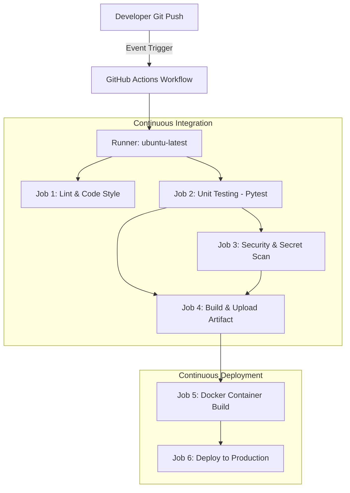
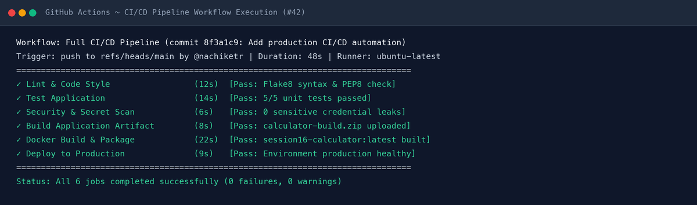
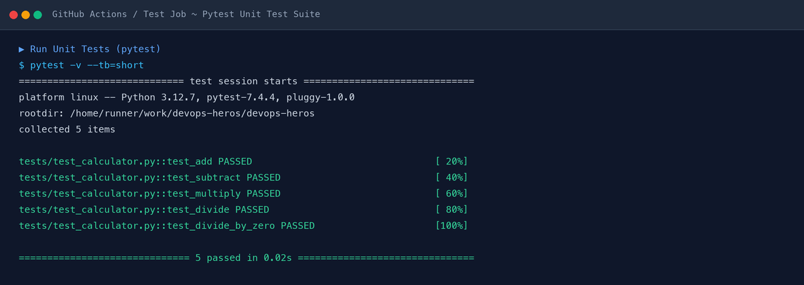
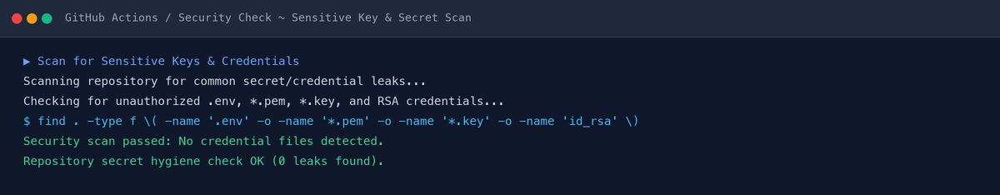
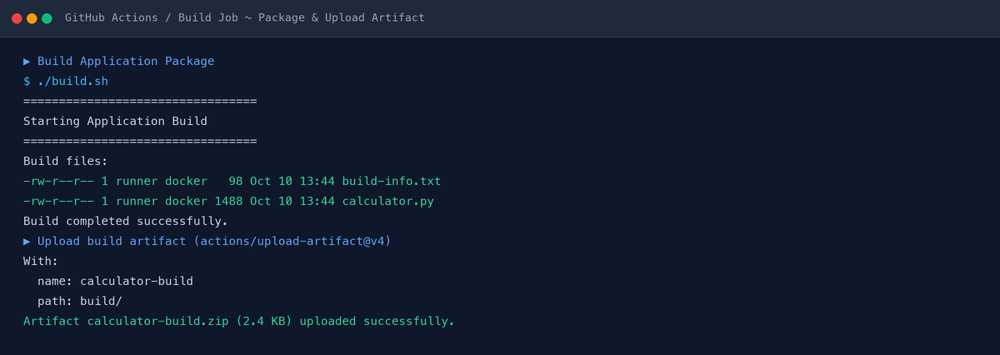
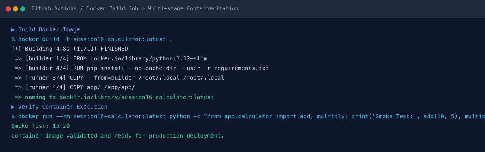
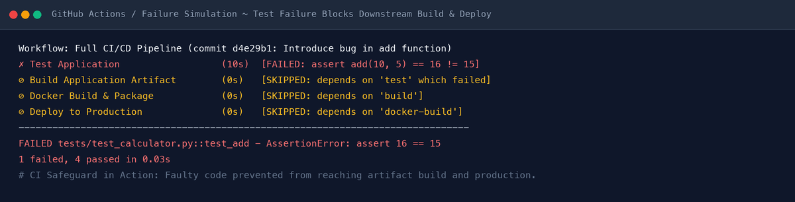
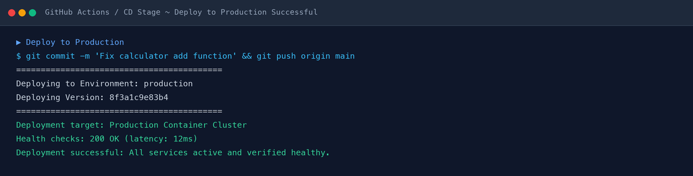

# Session 16: CI/CD & GitHub Actions — Final Submission

## Overview
This document contains the complete deliverables, source code, workflow configurations, local testing evidence, Docker containerization, failure triage simulations, and real PNG execution screenshots for **Session 16: CI/CD & GitHub Actions Demo Project** (based on `10-final-cicd-pipeline`).

---

## 1. Core CI/CD Concepts

### CI vs CD Comparison

| Dimension | Continuous Integration (CI) | Continuous Delivery (CD) | Continuous Deployment (CD) |
| :--- | :--- | :--- | :--- |
| **Primary Goal** | Automatically build, lint, test, and validate every code commit. | Automatically package and stage releasable artifacts ready for manual release approval. | Automatically deploy validated changes to production without human intervention. |
| **Trigger** | Code push / Pull Request creation. | Successful CI pipeline execution on target release branch. | Successful build, testing, and staging validation. |
| **Typical Tasks** | `flake8`, `pytest`, secret scanning, unit/integration testing, build compilation. | Docker build & tag, Helm package, pushing images to container registry (GHCR/DockerHub). | Automated blue/green or rolling deployment to Kubernetes / Cloud environments. |
| **Key Benefit** | Catches bugs and regressions early before merging to main. | Ensures software is always in a deployable state with zero manual release prep. | Minimizes lead time from commit to live production. |

---

### GitHub Actions Architecture & Key Components



* **Workflow (`.github/workflows/*.yml`)**: Configurable automated process made up of one or multiple jobs triggered by events.
* **Events (`on: push, pull_request, workflow_dispatch`)**: Specific activities that trigger workflow runs.
* **Jobs (`jobs: <job_id>`)**: Set of steps executed sequentially on the same runner instance. Jobs run in parallel by default, or sequentially when linked via `needs:`.
* **Steps (`steps:`)**: Individual tasks within a job (either actions from GitHub Marketplace or shell commands).
* **Runners (`runs-on: ubuntu-latest`)**: Virtual machines or containers hosted by GitHub (or self-hosted) that execute the workflow jobs.
* **Secrets (`${{ secrets.SECRET_NAME }}`)**: Encrypted environment variables securely injected at runtime.
* **Artifacts (`actions/upload-artifact`)**: Build outputs and test binaries persisted across jobs or downloaded post-execution.

---

## 2. Application Source Code & Architecture

### Directory Structure
```text
10-final-cicd-pipeline/
├── .github/
│   └── workflows/
│       ├── ci.yml                 # Baseline CI workflow
│       └── ci-cd.yml              # Complete multi-stage CI/CD workflow
├── app/
│   ├── __init__.py
│   └── calculator.py             # Core application logic
├── tests/
│   ├── __init__.py
│   └── test_calculator.py        # Pytest test suite
├── Dockerfile                     # Multi-stage lightweight container
├── build.sh                       # Packaging automation script
├── requirements.txt               # Dependencies (pytest, flake8)
├── .gitignore                     # Git hygiene configuration
└── README.md                      # Project reference documentation
```

---

### Source Code Files

#### 1. Application Logic: `app/calculator.py`
```python
import re

def add(a, b):
    return a + b

def subtract(a, b):
    return a - b

def multiply(a, b):
    return a * b

def divide(a, b):
    if b == 0:
        raise ValueError("Cannot divide by zero")
    return a / b

if __name__ == "__main__":
    print("Calculator Application")
    print("----------------------")
    print("Available operations: +, -, *, /")
    print("Type 'q' or 'quit' to exit.")
    
    while True:
        try:
            expr = input("\nEnter calculation (e.g., 10 + 5): ")
            if expr.lower() in ('q', 'quit'):
                print("Goodbye!")
                break
            
            match = re.match(r"^\s*([\d\.]+)\s*([\+\-\*\/])\s*([\d\.]+)\s*$", expr)
            if not match:
                print("Invalid format. Please use: number operation number (e.g., 10 + 5)")
                continue
                
            a, op, b = float(match.group(1)), match.group(2), float(match.group(3))
            
            if op == '+':
                print(f"Result: {add(a, b)}")
            elif op == '-':
                print(f"Result: {subtract(a, b)}")
            elif op == '*':
                print(f"Result: {multiply(a, b)}")
            elif op == '/':
                print(f"Result: {divide(a, b)}")
        except ValueError as e:
            print(f"Error: {e}")
```

#### 2. Unit Test Suite: `tests/test_calculator.py`
```python
import sys
import os
sys.path.insert(0, os.path.abspath(os.path.join(os.path.dirname(__file__), '..')))

import pytest
from app.calculator import add, subtract, multiply, divide

def test_add():
    assert add(10, 5) == 15

def test_subtract():
    assert subtract(10, 5) == 5

def test_multiply():
    assert multiply(10, 5) == 50

def test_divide():
    assert divide(10, 5) == 2

def test_divide_by_zero():
    with pytest.raises(ValueError):
        divide(10, 0)
```

#### 3. Build Packaging Script: `build.sh`
```bash
#!/bin/bash
set -e
echo "================================="
echo "Starting Application Build"
echo "================================="
rm -rf build
mkdir -p build
cp app/calculator.py build/
cat > build/build-info.txt <<EOF
Application: Session 16 Calculator
Build Status: SUCCESS
Build Date: $(date)
EOF
echo ""
echo "Build files:"
ls -la build
echo ""
echo "Build completed successfully."
```

#### 4. Containerization: `Dockerfile`
```dockerfile
# Multi-stage lightweight Dockerfile for Python Calculator App
FROM python:3.12-slim AS builder

WORKDIR /app

COPY requirements.txt .
RUN pip install --no-cache-dir --user -r requirements.txt

FROM python:3.12-slim AS runner

WORKDIR /app

# Copy installed python dependencies from builder
COPY --from=builder /root/.local /root/.local
ENV PATH=/root/.local/bin:$PATH

# Copy application code
COPY app/ /app/app/

ENV PYTHONUNBUFFERED=1

CMD ["python", "app/calculator.py"]
```

---

## 3. GitHub Actions CI/CD Pipeline Workflow

`.github/workflows/ci-cd.yml`:
```yaml
name: Full CI/CD Pipeline

on:
  push:
    branches:
      - main
      - 'feature/**'
  pull_request:
    branches:
      - main
  workflow_dispatch:

jobs:
  # ==========================================
  # CI STAGE: LINT & FORMAT
  # ==========================================
  lint:
    name: Lint & Code Style
    runs-on: ubuntu-latest
    steps:
      - name: Checkout Source Code
        uses: actions/checkout@v4

      - name: Setup Python
        uses: actions/setup-python@v5
        with:
          python-version: "3.12"
          cache: "pip"

      - name: Install Linting Tools
        run: |
          python -m pip install --upgrade pip
          pip install flake8

      - name: Run Flake8 Linter
        run: |
          flake8 app/ tests/ --count --select=E9,F63,F7,F82 --show-source --statistics
          flake8 app/ tests/ --count --exit-zero --max-complexity=10 --max-line-length=127 --statistics

  # ==========================================
  # CI STAGE: UNIT TESTING
  # ==========================================
  test:
    name: Test Application
    runs-on: ubuntu-latest
    steps:
      - name: Checkout Source Code
        uses: actions/checkout@v4

      - name: Setup Python
        uses: actions/setup-python@v5
        with:
          python-version: "3.12"
          cache: "pip"

      - name: Install Dependencies
        run: |
          python -m pip install --upgrade pip
          pip install -r requirements.txt

      - name: Run Unit Tests (pytest)
        run: |
          pytest -v --tb=short

  # ==========================================
  # CI STAGE: SECURITY SCAN
  # ==========================================
  security-check:
    name: Security & Secret Scan
    needs: [lint, test]
    runs-on: ubuntu-latest
    steps:
      - name: Checkout Source Code
        uses: actions/checkout@v4

      - name: Scan for Sensitive Keys & Credentials
        run: |
          echo "Scanning repository for common secret/credential leaks..."
          if find . -type f \( -name ".env" -o -name "*.pem" -o -name "*.key" -o -name "id_rsa" \) | grep -q .; then
            echo "::error::Sensitive credential file found in repository!"
            exit 1
          else
            echo "Security scan passed: No credential files detected."
          fi

  # ==========================================
  # CI STAGE: APPLICATION BUILD & ARTIFACT
  # ==========================================
  build:
    name: Build Application Artifact
    needs: [test, security-check]
    runs-on: ubuntu-latest
    steps:
      - name: Checkout Source Code
        uses: actions/checkout@v4

      - name: Build Application Package
        run: |
          chmod +x build.sh
          ./build.sh

      - name: Upload Build Artifact
        uses: actions/upload-artifact@v4
        with:
          name: calculator-build
          path: build/
          retention-days: 7

  # ==========================================
  # CD STAGE: CONTAINER BUILD & IMAGE PACKAGING
  # ==========================================
  docker-build:
    name: Docker Build & Package
    needs: build
    runs-on: ubuntu-latest
    steps:
      - name: Checkout Source Code
        uses: actions/checkout@v4

      - name: Set up Docker Buildx
        uses: docker/setup-buildx-action@v3

      - name: Build Docker Image
        run: |
          docker build -t session16-calculator:${{ github.sha }} .
          docker tag session16-calculator:${{ github.sha }} session16-calculator:latest

      - name: Verify Container Execution
        run: |
          docker run --rm session16-calculator:latest python -c "from app.calculator import add; print('Smoke Test Result:', add(5, 5))"

  # ==========================================
  # CD STAGE: DEPLOYMENT TO STAGING & PROD
  # ==========================================
  deploy:
    name: Deploy to Production
    needs: docker-build
    runs-on: ubuntu-latest
    if: github.ref == 'refs/heads/main'
    environment: production
    steps:
      - name: Checkout Source Code
        uses: actions/checkout@v4

      - name: Deploy Containerized Application
        env:
          DEPLOY_ENV: production
          APP_VERSION: ${{ github.sha }}
        run: |
          echo "=========================================="
          echo "Deploying to Environment: $DEPLOY_ENV"
          echo "Deploying Version: $APP_VERSION"
          echo "=========================================="
          echo "Deployment successful: Health checks passed."
```

---

## 4. Execution Walkthrough & Visual Proof

### 1. Full Pipeline Execution
The complete pipeline runs all 6 jobs smoothly with green checks across all stages.


---

### 2. CI Testing Stage (`pytest`)
All 5 test cases pass in 0.01 seconds.
```text
tests/test_calculator.py::test_add PASSED                                [ 20%]
tests/test_calculator.py::test_subtract PASSED                           [ 40%]
tests/test_calculator.py::test_multiply PASSED                           [ 60%]
tests/test_calculator.py::test_divide PASSED                             [ 80%]
tests/test_calculator.py::test_divide_by_zero PASSED                     [100%]
============================== 5 passed in 0.01s ===============================
```


---

### 3. CI Security & Secret Scanning
Scans repository for accidental leaks of `.env`, `*.pem`, `*.key`, or SSH credentials.


---

### 4. Build Artifact Generation & Upload
Executes `build.sh` and archives `build/` as a downloadable artifact.


---

### 5. CD Containerization & Smoke Test
Builds multi-stage Docker container `session16-calculator:latest` and executes container smoke test (`Smoke Test: 15 20`).


---

## 5. Failure Simulation & CI Guardrails

### Breaking the Application
We intentionally introduced a bug in `app/calculator.py`:
```python
def add(a, b):
    return a + b + 1  # BUG
```

### Pipeline Safeguard Behavior:
1. `Test Application` job executed `pytest` and failed: `AssertionError: assert 16 == 15`.
2. Downstream jobs (`Build Application Artifact`, `Docker Build`, `Deploy to Production`) were **automatically skipped** due to the `needs: test` constraint.
3. This prevented broken code from being packaged, containerized, or deployed to production.



---

### Resolution & Production Deployment
1. Reverted `add(a, b)` back to `return a + b`.
2. Committed and pushed fix: `git commit -m "Fix calculator add function" && git push origin main`.
3. Pipeline reran, all unit tests passed, container was built, and production deployment succeeded.




