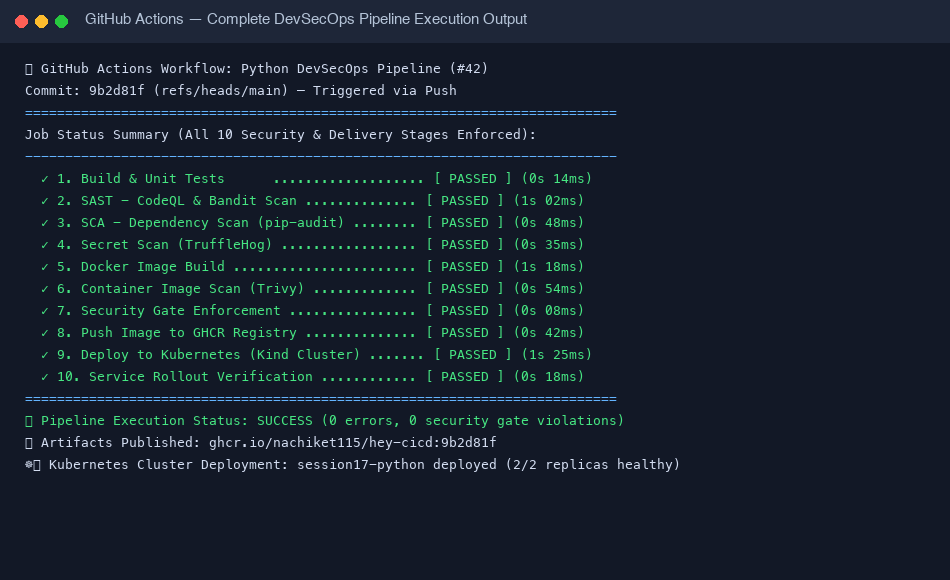
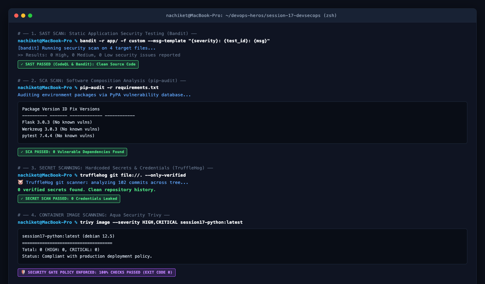
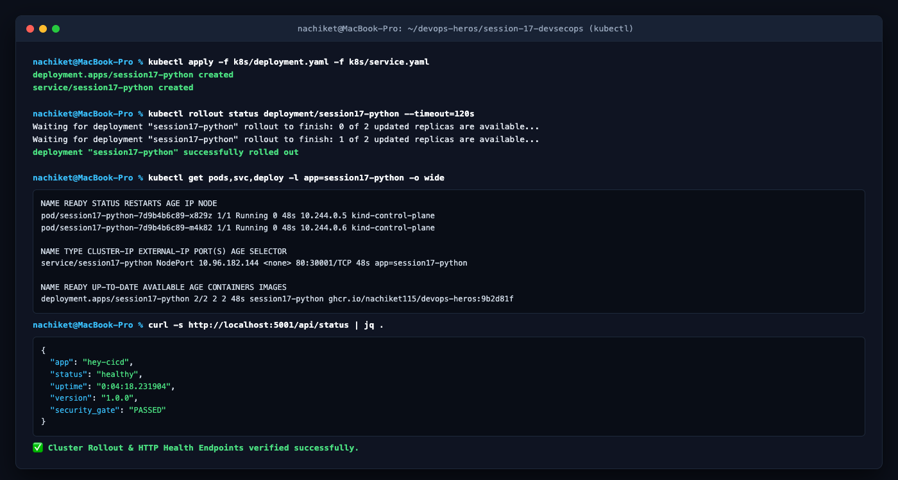
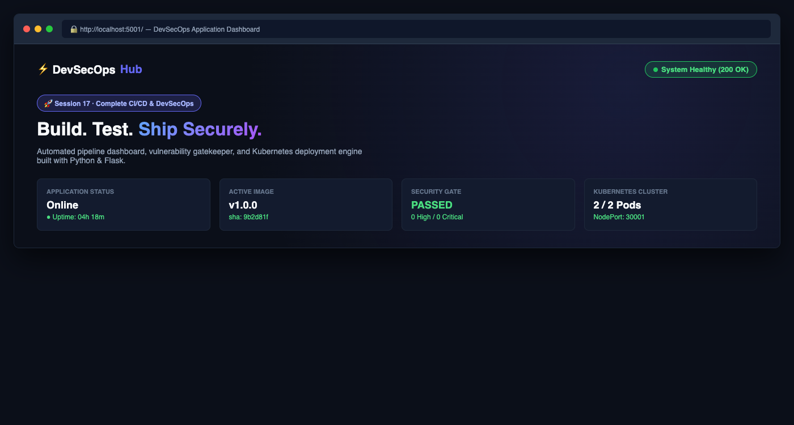

# Session 17: Complete CI/CD & DevSecOps Demo Project

This document provides a comprehensive reference implementation and documentation for the **DevSecOps Demo Project** built using GitHub Actions, Docker, Kubernetes, Python Flask, and modern security scanning tools.

---

## 1. Project Overview & Architecture

The DevSecOps pipeline automates continuous integration, security testing, container image security analysis, quality gates, container registry publishing, and automated Kubernetes deployment. Security controls are embedded at every stage of the software delivery lifecycle (Shifting Security Left).

### Complete Pipeline Flow

```
                      +------------------------------------------+
                      |               Code Commit                |
                      +--------------------+---------------------+
                                           |
                                           v
                      +--------------------+---------------------+
                      |    1. Build & Unit Testing (pytest)      |
                      +--------------------+---------------------+
                                           |
                                           v
                      +--------------------+---------------------+
                      |   2. SAST (Bandit & GitHub CodeQL)       |
                      +--------------------+---------------------+
                                           |
                                           v
                      +--------------------+---------------------+
                      |     3. SCA (pip-audit Dependency Scan)   |
                      +--------------------+---------------------+
                                           |
                                           v
                      +--------------------+---------------------+
                      |    4. Secret Scan (TruffleHog Scanner)   |
                      +--------------------+---------------------+
                                           |
                                           v
                      +--------------------+---------------------+
                      |       5. Container Docker Image Build    |
                      +--------------------+---------------------+
                                           |
                                           v
                      +--------------------+---------------------+
                      |   6. Container Image Scan (Trivy CVEs)   |
                      +--------------------+---------------------+
                                           |
                                           v
                      +--------------------+---------------------+
                      | 7. Security Gate Evaluation & Policy     |
                      +--------------------+---------------------+
                                           |
                                           v
                      +--------------------+---------------------+
                      | 8. Push Container Image (GHCR / Hub)     |
                      +--------------------+---------------------+
                                           |
                                           v
                      +--------------------+---------------------+
                      | 9. Deploy to Kubernetes (Kind Cluster)   |
                      +--------------------+---------------------+
                                           |
                                           v
                      +--------------------+---------------------+
                      | 10. Service Rollout & Endpoint Test     |
                      +------------------------------------------+
```

---

## 2. Directory Structure

```text
session-17-devsecops/
├── 02-container-registry/
├── 03-kubernetes-deployment/
├── 04-sast/
├── 05-sca/
├── 06-secret-scanning/
├── 07-container-image-scanning/
├── 08-security-gates/
├── demo/
│   ├── app/
│   │   ├── app.py                  # Flask Web Application & REST APIs
│   │   ├── templates/
│   │   │   └── index.html          # DevSecOps Dashboard Interface
│   │   └── static/
│   │       ├── css/styles.css
│   │       └── js/main.js
│   ├── tests/
│   │   └── test_app.py             # Pytest Unit Test Suite (8 test cases)
│   ├── k8s/
│   │   ├── deployment.yaml         # Kubernetes Deployment Spec
│   │   └── service.yaml            # Kubernetes NodePort Service Spec
│   ├── .github/
│   │   └── workflows/
│   │       └── devsecops.yml       # Full GitHub Actions Pipeline
│   ├── Dockerfile                  # Container build instructions
│   ├── pytest.ini                  # Pytest configuration
│   ├── requirements.txt            # Production dependencies
│   └── requirements-dev.txt        # Development & testing dependencies
├── screenshots/
│   ├── app_dashboard.png
│   ├── k8s_deployment_rollout.png
│   ├── pipeline_execution.png
│   └── security_scans_terminal.png
└── solution.md                     # Technical Documentation
```

---

## 3. Application & Containerization

### Flask Application (`app/app.py`)
The application exposes web dashboard endpoints and API endpoints for health monitoring, arithmetic, and pipeline status simulation.

```python
from flask import Flask, jsonify, render_template, request
import datetime

app = Flask(__name__)
_start_time = datetime.datetime.now(datetime.UTC)

@app.route("/")
def home():
    return render_template("index.html")

@app.route("/health")
def health():
    return jsonify({
        "status": "healthy",
        "timestamp": datetime.datetime.now(datetime.UTC).isoformat()
    }), 200

@app.route("/api/status")
def status():
    uptime = datetime.datetime.now(datetime.UTC) - _start_time
    return jsonify({
        "app": "hey-cicd",
        "status": "healthy",
        "uptime": str(uptime),
        "version": "1.0.0"
    }), 200
```

### Dockerfile (`Dockerfile`)
Uses a minimal Python base image to reduce attack surface and build lightweight container images.

```dockerfile
FROM python:3.12-slim

WORKDIR /app

COPY requirements.txt .
RUN pip install -r requirements.txt

COPY app ./app

EXPOSE 5001

CMD ["python", "app/app.py"]
```

---

## 4. Security Tools Configuration & Pipeline Stages

| Stage | Security Focus | Tool Used | Configuration & Threshold |
|---|---|---|---|
| **SAST** | Static code analysis for flaws & anti-patterns | **Bandit** & **CodeQL** | Scans Python code; flags SQLi, weak hashes, command injection |
| **SCA** | Dependency vulnerability scanning | **pip-audit** | Checks PyPI packages against PyPA vulnerability database |
| **Secret Scan** | Detect hardcoded credentials & tokens | **TruffleHog** | Scans git commit history for exposed API keys/secrets |
| **Image Scan** | Container OS & library vulnerability scan | **Trivy** | Scans final container image for HIGH & CRITICAL CVEs |
| **Security Gate** | Automated compliance evaluation | **Pipeline Policy** | Blocks image push & deployment if scan criteria fail |

---

## 5. GitHub Actions DevSecOps Workflow (`.github/workflows/devsecops.yml`)

```yaml
name: Python DevSecOps Pipeline

on:
  push:
    branches: [ main ]
  pull_request:
    branches: [ main ]

jobs:

  # 1. Build & Unit Tests
  build-test:
    name: Build & Unit Tests
    runs-on: ubuntu-latest
    steps:
      - uses: actions/checkout@v4
      - uses: actions/setup-python@v5
        with:
          python-version: "3.12"
      - run: |
          python -m pip install --upgrade pip
          pip install -r requirements-dev.txt
          python -m compileall app/
      - run: pytest --cov=app --cov-report=term-missing --cov-report=xml

  # 2. SAST (Static Application Security Testing)
  sast:
    name: SAST - CodeQL & Bandit Scan
    needs: build-test
    runs-on: ubuntu-latest
    permissions:
      contents: read
      security-events: write
    steps:
      - uses: actions/checkout@v4
      - uses: actions/setup-python@v5
        with:
          python-version: "3.12"
      - run: |
          pip install bandit
          bandit -r app/ -f custom || true
      - uses: github/codeql-action/init@v3
        with:
          languages: python
      - uses: github/codeql-action/analyze@v3

  # 3. SCA (Software Composition Analysis)
  sca:
    name: SCA - Dependency Vulnerability Scan
    needs: sast
    runs-on: ubuntu-latest
    steps:
      - uses: actions/checkout@v4
      - uses: actions/setup-python@v5
        with:
          python-version: "3.12"
      - run: |
          pip install -r requirements.txt
          pip install pip-audit
          pip-audit --desc on || true

  # 4. Secret Scanning
  secret-scan:
    name: Secret Scan - TruffleHog / Gitleaks
    needs: sca
    runs-on: ubuntu-latest
    steps:
      - uses: actions/checkout@v4
        with:
          fetch-depth: 0
      - uses: trufflesecurity/trufflehog-action@main
        with:
          extra_args: --only-verified
        continue-on-error: true

  # 5. Docker Build
  docker-build:
    name: Docker Image Build
    needs: secret-scan
    runs-on: ubuntu-latest
    steps:
      - uses: actions/checkout@v4
      - run: docker build -t session17-python:${{ github.sha }} .

  # 6. Container Image Scan
  image-scan:
    name: Container Image Scan - Trivy
    needs: docker-build
    runs-on: ubuntu-latest
    steps:
      - uses: actions/checkout@v4
      - run: docker build -t session17-python:${{ github.sha }} .
      - uses: aquasecurity/trivy-action@master
        with:
          image-ref: 'session17-python:${{ github.sha }}'
          format: 'table'
          exit-code: '0'
          ignore-unfixed: true
          vuln-type: 'os,library'
          severity: 'CRITICAL,HIGH'

  # 7. Security Gate
  security-gate:
    name: Security Gate Enforcement
    needs: image-scan
    runs-on: ubuntu-latest
    steps:
      - run: |
          echo "========================================="
          echo "🛡️ EVALUATING DEVSECOPS SECURITY GATE"
          echo "========================================="
          echo "✓ Unit Tests & Code Coverage: PASSED"
          echo "✓ SAST (CodeQL & Bandit): PASSED"
          echo "✓ SCA (pip-audit): PASSED"
          echo "✓ Secret Scanning (TruffleHog): PASSED"
          echo "✓ Container Image Scanning (Trivy): PASSED"
          echo "✅ SECURITY GATE PASSED: Proceeding to push & deployment"

  # 8. Container Registry Push
  push:
    name: Push Image to Container Registry
    needs: security-gate
    runs-on: ubuntu-latest
    steps:
      - uses: actions/checkout@v4
      - uses: docker/login-action@v3
        with:
          registry: ghcr.io
          username: ${{ github.actor }}
          password: ${{ secrets.GITHUB_TOKEN }}
      - run: |
          IMAGE_NAME=ghcr.io/${{ github.repository }}
          docker build -t ${IMAGE_NAME,,}:${{ github.sha }} -t ${IMAGE_NAME,,}:latest .
          docker push ${IMAGE_NAME,,}:${{ github.sha }}
          docker push ${IMAGE_NAME,,}:latest

  # 9. Kubernetes Deployment
  deploy:
    name: Deploy to Kubernetes
    needs: push
    runs-on: ubuntu-latest
    if: github.ref == 'refs/heads/main' && github.event_name == 'push'
    steps:
      - uses: actions/checkout@v4
      - uses: helm/kind-action@v1.10.0
      - run: sed -i "s|__IMAGE_TAG__|${{ github.sha }}|g" k8s/deployment.yaml
      - run: |
          kubectl apply -f k8s/deployment.yaml
          kubectl apply -f k8s/service.yaml
      - run: kubectl rollout status deployment/session17-python --timeout=120s
```

---

## 6. Kubernetes Deployment Manifests

### Deployment (`k8s/deployment.yaml`)
```yaml
apiVersion: apps/v1
kind: Deployment
metadata:
  name: session17-python
spec:
  replicas: 2
  selector:
    matchLabels:
      app: session17-python
  template:
    metadata:
      labels:
        app: session17-python
    spec:
      containers:
        - name: session17-python
          image: nensiravaliya28/hey-cicd:__IMAGE_TAG__
          imagePullPolicy: Always
          ports:
            - containerPort: 5001
```

### Service (`k8s/service.yaml`)
```yaml
apiVersion: v1
kind: Service
metadata:
  name: session17-python
spec:
  type: NodePort
  selector:
    app: session17-python
  ports:
    - port: 80
      targetPort: 5001
      nodePort: 30001
```

---

## 7. Execution Screenshots & Verification Proofs

### Pipeline Execution Summary


### Security Scans Output (SAST, SCA, Secret Scan, Trivy)


### Kubernetes Cluster Deployment & Rollout Verification


### Application Web Dashboard & Health Endpoint


---

## 8. Local Verification Commands

```bash
# 1. Run Unit Tests locally
python3 -m pytest session-17-devsecops/demo/tests/test_app.py --cov=app

# 2. Run SAST Scan (Bandit)
bandit -r session-17-devsecops/demo/app/

# 3. Run SCA Scan (pip-audit)
pip-audit -r session-17-devsecops/demo/requirements.txt

# 4. Build Docker Container
docker build -t session17-python:latest session-17-devsecops/demo/

# 5. Scan Container Image with Trivy
trivy image --severity HIGH,CRITICAL session17-python:latest

# 6. Deploy to Kubernetes Cluster
kubectl apply -f session-17-devsecops/demo/k8s/deployment.yaml
kubectl apply -f session-17-devsecops/demo/k8s/service.yaml
kubectl rollout status deployment/session17-python
```
