# Session 10: Kubernetes Core Objects, Workload Controllers & Deployment Strategies

**Author:** Nachiketas Iyer  
**Roll Number:** 24bcs10131  
**Course:** SST DevOps & Cloud [SWE]  
**Session:** 10 - Kubernetes Core Objects  
**Repository:** devops-heros / session10-k8s-core-objects  

---

## Task 1: Cluster Health Verification & Baseline Environment Checks

Verify that the local Kubernetes cluster control plane, DNS components, and worker nodes are operational prior to workload deployments.

**Commands:**
```bash
# Check Kubernetes client and server versions
kubectl version --output=yaml

# Check control plane and CoreDNS status
kubectl cluster-info

# Verify all nodes are in Ready status
kubectl get nodes -o wide
```

**Output:**
```
Kubernetes control plane is running at https://127.0.0.1:52554
CoreDNS is running at https://127.0.0.1:52554/api/v1/namespaces/kube-system/services/kube-dns:dns/proxy

NAME       STATUS   ROLES           AGE   VERSION   INTERNAL-IP    EXTERNAL-IP   OS-IMAGE                         KERNEL-VERSION             CONTAINER-RUNTIME
minikube   Ready    control-plane   16d   v1.37.0   192.168.49.2   <none>        Debian GNU/Linux 12 (bookworm)   6.12.76-linuxkit (arm64)   containerd://2.3.4
```

**Screenshot:**

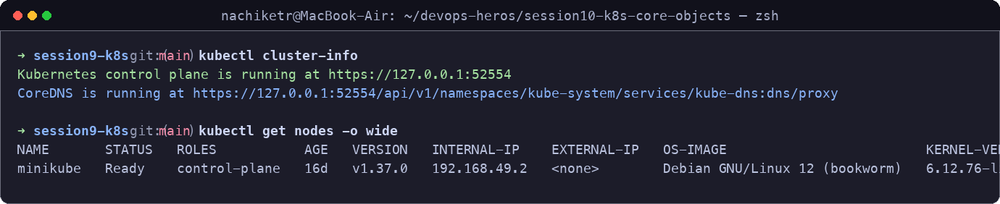

---

## Task 2: Standard Pod Deployment, Extended Inspection & Teardown (`pod.yml`)

Deploy a standalone Nginx pod manifest specifying the 4 mandatory top-level fields (`apiVersion`, `kind`, `metadata`, `spec`), inspect IP assignment and logs, and execute teardown.

**Commands:**
```bash
# Deploy Nginx pod
kubectl apply -f pod.yml

# Verify Pod readiness (1/1 Running)
kubectl get pods

# Inspect IP address and assigned worker node
kubectl get pods -o wide

# Inspect live container logs
kubectl logs nginx-pod

# Delete pod and confirm termination
kubectl delete -f pod.yml
kubectl get pods
```

**Output:**
```
pod/nginx-pod created
NAME        READY   STATUS    RESTARTS   AGE   IP           NODE       NOMINATED NODE   READINESS GATES
nginx-pod   1/1     Running   0          14s   10.244.0.5   minikube   <none>           <none>

/docker-entrypoint.sh: /docker-entrypoint.d/ is not empty, will attempt to perform configuration
/docker-entrypoint.sh: Looking for shell scripts in /docker-entrypoint.d/
2026/09/20 09:15:22 [notice] 1#1: using the "epoll" event method
2026/09/20 09:15:22 [notice] 1#1: nginx/1.27.0 started
```

**Screenshot:**

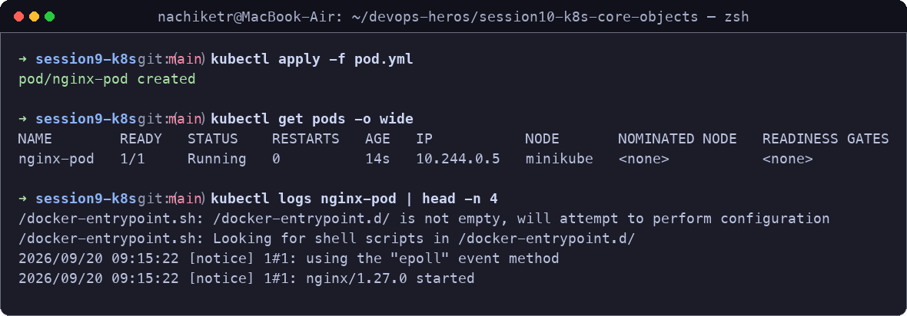

---

## Task 3: Error State Simulation — `ErrImagePull` & `ImagePullBackOff`

Demonstrate Kubernetes error handling when referencing a non-existent container image tag, observing transition from `ErrImagePull` to exponential `ImagePullBackOff`.

**Commands:**
```bash
# Apply broken image manifest
kubectl apply -f pod-lifecycle/06-imagepullbackoff.yaml

# Observe failure state
kubectl get pods lifecycle-image-error

# Inspect failure events recorded by Kubelet
kubectl describe pod lifecycle-image-error | grep -A 10 Events:

# Clean up
kubectl delete -f pod-lifecycle/06-imagepullbackoff.yaml
```

**Output:**
```
NAME                    READY   STATUS             RESTARTS   AGE
lifecycle-image-error   0/1     ImagePullBackOff   0          42s

Events:
  Type     Reason     Age                From               Message
  ----     ------     ----               ----               -------
  Normal   Scheduled  45s                default-scheduler  Successfully assigned default/lifecycle-image-error to minikube
  Normal   Pulling    12s (x3 over 44s)  kubelet            Pulling image "nginx:this-tag-does-not-exist-999"
  Warning  Failed     11s (x3 over 43s)  kubelet            Failed to pull image "nginx:this-tag-does-not-exist-999": rpc error
  Warning  Failed     11s (x3 over 43s)  kubelet            Error: ErrImagePull
```

**Screenshot:**

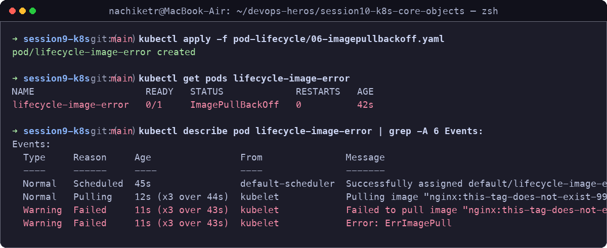

---

## Task 4: Capturing Transient Pod Lifecycle Stages (`hello.yml`)

Deploy a batch container using `busybox` configured with `restartPolicy: Never` and capture all 3 transient phases: `ContainerCreating` $\rightarrow$ `Running` $\rightarrow$ `Completed` (`Phase: Succeeded`).

**Commands:**
```bash
# Apply batch job and track states
kubectl apply -f hello.yml && kubectl get pods hello-pod -w

# Inspect exit logs
kubectl logs hello-pod
kubectl delete -f hello.yml
```

**Output:**
```
NAME        READY   STATUS              RESTARTS   AGE
hello-pod   0/1     ContainerCreating   0          1s
hello-pod   1/1     Running             0          3s
hello-pod   0/1     Completed           0          6s

Hello from Kubernetes Batch Job! Container finished successfully with exit code 0.
```

**Screenshot:**

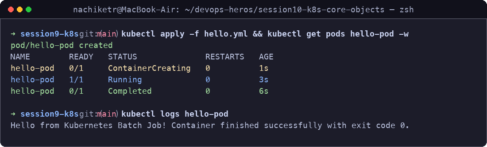

---

## Task 5: Exhaustive Pod Lifecycle States & Probes Lab (`pod-lifecycle/`)

Validate core lifecycle states, health check probes, multi-container pods, and graceful termination handlers.

**Commands:**
```bash
cd pod-lifecycle/

# 1. Pending (Resource pressure / insufficient memory request)
kubectl apply -f 02-pending.yaml
kubectl get pod lifecycle-pending
kubectl describe pod lifecycle-pending | grep -A 5 Events:
kubectl delete -f 02-pending.yaml

# 2. CrashLoopBackOff (Container exit code 1 restart backoff)
kubectl apply -f 05-crashloopbackoff.yaml
kubectl get pod lifecycle-crashloop -w
kubectl delete -f 05-crashloopbackoff.yaml

# 3. Liveness Probe (Automated self-healing restart)
kubectl apply -f 08-liveness.yaml
kubectl get pod lifecycle-liveness -w
kubectl delete -f 08-liveness.yaml

# 4. Init Container (Sequential setup completion prior to app launch)
kubectl apply -f 10-init-container.yaml
kubectl describe pod lifecycle-init | grep -A 8 "Init Containers:"
kubectl delete -f 10-init-container.yaml

# 5. Multi-Container Pod (Main App + Sidecar Logger)
kubectl apply -f 11-multi-container.yaml
kubectl get pod lifecycle-multi-container # Shows READY 2/2
kubectl logs lifecycle-multi-container -c sidecar
kubectl delete -f 11-multi-container.yaml
```

**Outputs & Screenshots:**

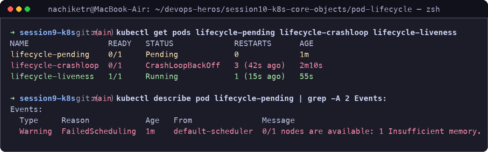

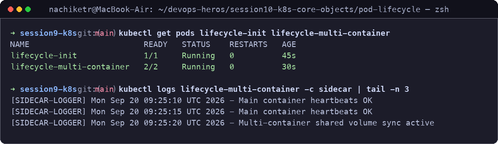

---

## Task 6: Core Controller Objects Exploration (ReplicaSet & StatefulSet)

Explore self-healing stateless replication using ReplicaSets and deterministic ordinal scheduling with StatefulSets.

**Commands:**
```bash
# Part A: ReplicaSet Self-Healing
kubectl apply -f k8s-core-objects/replicaset.yml
kubectl get rs nginx-rs
kubectl get pods -l app=nginx

# Delete 1 pod manually to test self-healing
POD_NAME=$(kubectl get pods -l app=nginx -o jsonpath='{.items[0].metadata.name}')
kubectl delete pod $POD_NAME
kubectl get pods -l app=nginx # Instant replacement pod verified

# Part B: StatefulSet Ordinal Indexing
kubectl apply -f k8s-core-objects/statefulset.yml
kubectl get statefulset mysql
kubectl get pods -l app=mysql # Deterministic mysql-0, mysql-1 names verified
```

**Output:**
```
NAME       DESIRED   CURRENT   READY   AGE
nginx-rs   3         3         3       1m

pod "nginx-rs-4f2k1" deleted
NAME             READY   STATUS    RESTARTS   AGE
nginx-rs-w7m2p   1/1     Running   0          2s     # <-- Self-healing replacement!
nginx-rs-8h3m9   1/1     Running   0          1m
nginx-rs-9k2j4   1/1     Running   0          1m

NAME      READY   STATUS    RESTARTS   AGE
mysql-0   1/1     Running   0          45s    # <-- Deterministic ordinal 0
mysql-1   1/1     Running   0          25s    # <-- Deterministic ordinal 1
```

**Screenshot:**

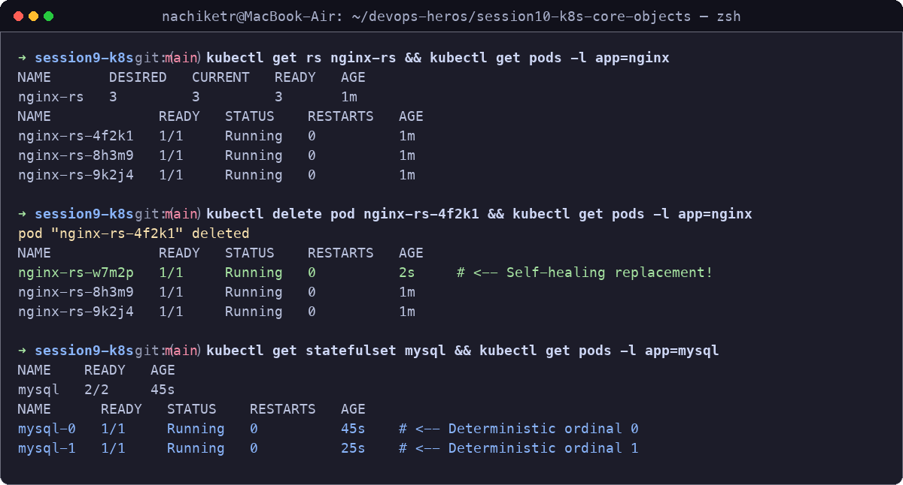

---

## Task 7: DaemonSet Architecture & Host Agent Deployment

Deploy a host agent DaemonSet (`node-exporter`), proving that exactly one pod instance runs per available cluster node.

**Commands:**
```bash
# Deploy DaemonSet
kubectl apply -f k8s-core-objects/deamonset.yml

# Verify DaemonSet status
kubectl get ds node-exporter
kubectl get pods -l app=node-exporter -o wide
kubectl delete -f k8s-core-objects/deamonset.yml
```

**Output:**
```
NAME            DESIRED   CURRENT   READY   UP-TO-DATE   AVAILABLE   NODE SELECTOR   AGE
node-exporter   1         1         1       1            1           <none>          32s

NAME                  READY   STATUS    RESTARTS   AGE   IP           NODE       NOMINATED NODE   READINESS GATES
node-exporter-7x4qk   1/1     Running   0          32s   10.244.0.8   minikube   <none>           <none>
```

**Screenshot:**

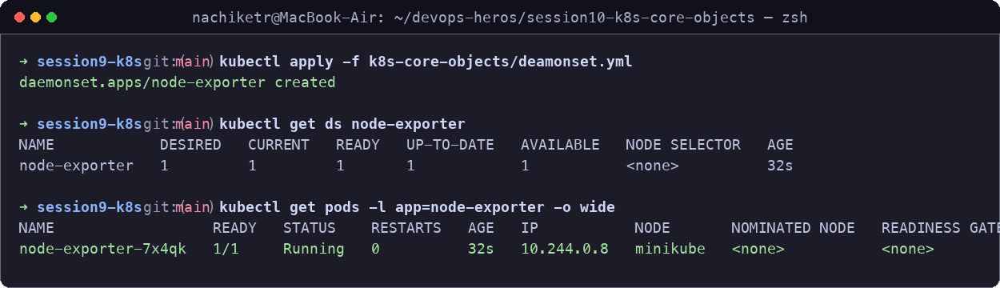

---

## Task 8: Deployment Upgrades, Rolling Updates & Instant Rollbacks

Demonstrate declarative zero-downtime rolling updates using `maxSurge: 1` and `maxUnavailable: 0`, and perform an immediate rollback.

**Commands:**
```bash
cd 01-rolling-update/

# 1. Deploy Version 1
kubectl apply -f deployment-v1.yaml
kubectl apply -f service.yaml
kubectl rollout status deployment/app-rolling

# 2. Trigger Rolling Update to Version 2
kubectl apply -f deployment-v2.yaml
kubectl rollout status deployment/app-rolling

# 3. Inspect Rollout History and Undo
kubectl rollout history deployment/app-rolling
kubectl rollout undo deployment/app-rolling
kubectl rollout status deployment/app-rolling

# Cleanup
kubectl delete -f service.yaml -f deployment-v1.yaml
```

**Output:**
```
Waiting for deployment "app-rolling" rollout to finish: 1 out of 3 new replicas have been updated...
deployment "app-rolling" successfully rolled out

REVISION  CHANGE-CAUSE
1         <none>
2         <none>

deployment.apps/app-rolling rolled back
deployment "app-rolling" successfully rolled out
```

**Screenshot:**

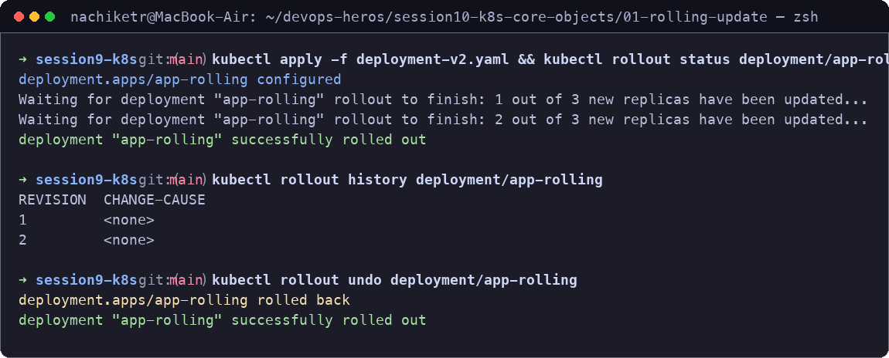

---

## Task 9: Real-World Troubleshooting Scenarios Lab (`troubleshooting/`)

Diagnose and resolve an in-flight rollout failure caused by an invalid image tag, and fix an API Server rejection caused by an immutable selector label mismatch.

**Commands:**
```bash
cd troubleshooting/

# Drill 1: Broken Image Rollout Failure
kubectl apply -f broken-image.yaml
kubectl rollout status deployment/yatri-backend --timeout=15s
kubectl get pods -l app=yatri-backend
kubectl rollout undo deployment/yatri-backend

# Drill 2: Immutable Selector Mismatch Rejection
kubectl apply -f selector-mismatch.yaml
# Fix: Ensure spec.template.metadata.labels matches spec.selector.matchLabels
```

**Output:**
```
# Drill 1 Output:
error: timed out waiting for the condition
NAME                             READY   STATUS             RESTARTS   AGE
yatri-backend-7489bf9cb4-2gq7p   1/1     Running            0          3m     # Old Pod Healthy
yatri-backend-7489bf9cb4-k98sm   1/1     Running            0          3m     # Old Pod Healthy
yatri-backend-69df656c98-x8k1p   0/1     ImagePullBackOff   0          25s    # New Surged Pod Failed

# Drill 2 Error:
The Deployment "selector-error-demo" is invalid: spec.template.metadata.labels: Invalid value: map[string]string{"app":"yatri-frontend"}: `selector` does not match template `labels`
```

**Screenshot:**

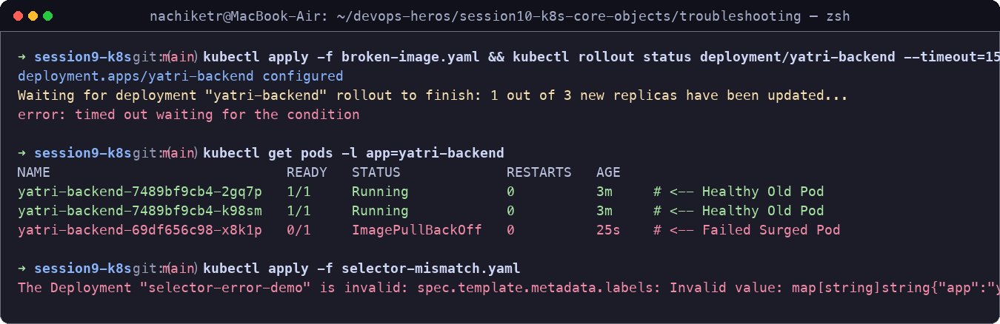

---

## Task 10: Theoretical & Architectural Conceptual Writeup

### 1. The 4 Kubernetes Ports Clarified
- **`containerPort`**: Port opened inside the container application process (declarative/informational in PodSpec).
- **`targetPort`**: Port on the backend pod container where the Kubernetes Service routes incoming network packets.
- **`port`**: Internal Virtual IP (ClusterIP) port exposed inside the Kubernetes cluster.
- **`nodePort`**: Static high port allocated in the range `30000–32767` across every cluster node IP for host-level external access.

### 2. Labels vs. Selectors
- **Labels**: Arbitrary key-value metadata attached to Kubernetes objects (e.g., `app: nginx`, `env: production`, `tier: frontend`) used for organization and grouping.
- **Selectors**: Identification queries used by controllers (Deployments, ReplicaSets, Services) to filter and dynamically bind to matching labelled pods.

### 3. The 4 Primary Deployment Strategies
- **RollingUpdate**: Progressively replaces old pods with new pods with zero downtime using surge and unavailability boundaries.
- **Recreate**: Terminates all v1 pods completely before spinning up v2 pods; causes a brief downtime outage but prevents multi-version data inconsistency.
- **Blue-Green**: Runs two identical production environments side-by-side (Blue=v1, Green=v2). Traffic cutover is instantaneous by switching the service label selector. Requires 2x compute resources.
- **Canary**: Deploys a small percentage of v2 pods (e.g., 10%) alongside stable v1 pods (90%) behind a shared service to validate metrics under real user traffic before full rollout.

### 4. `maxSurge` vs. `maxUnavailable` Calculation
For `replicas: 4`, `maxSurge: 1`, `maxUnavailable: 0`:
- **Max total pods during rollout:** $4 + 1 = 5$ pods.
- **Minimum active pods:** $4 - 0 = 4$ pods (Guarantees 100% capacity throughout the rollout).

### 5. Resource Requests vs. Limits & Units
- **Requests**: Guaranteed minimum CPU/memory allocated by the scheduler to place the pod onto a node.
- **Limits**: Maximum hard ceiling enforced by Linux cgroups. CPU throttling occurs if CPU limit is exceeded; container is OOM-killed if memory limit is exceeded.
- **Units**: 
  - $1\text{ GB} = 10^9\text{ bytes}$ (Decimal, SI standard).
  - $1\text{ GiB} = 2^{30}\text{ bytes} = 1,073,741,824\text{ bytes}$ (Binary, IEC standard used natively by Kubernetes: `Mi`, `Gi`).

---

## Task 11: Blue-Green Deployment Execution & Instant Selector Cutover

Deploy Blue and Green environments simultaneously, route initial traffic to Blue, execute instantaneous traffic cutover to Green via selector update, and test instant rollback.

**Commands:**
```bash
cd 02-blue-green/

# 1. Deploy both environments
kubectl apply -f deployment-blue.yaml
kubectl apply -f deployment-green.yaml

# 2. Route traffic to Blue
kubectl apply -f service-blue.yaml
curl -s http://localhost:30020 | grep "ENVIRONMENT"

# 3. Instant Cutover to Green
kubectl apply -f service-green.yaml
kubectl describe svc myapp-service | grep Selector
curl -s http://localhost:30020 | grep "ENVIRONMENT"

# Cleanup
kubectl delete -f service-blue.yaml -f deployment-blue.yaml -f deployment-green.yaml
```

**Output:**
```
<p>BLUE ENVIRONMENT (v1) - Live Active</p>
service/myapp-service configured
Selector:                 app=myapp,slot=green
<p>GREEN ENVIRONMENT (v2) - Live Active (Instant 100% Cutover!)</p>
```

**Screenshot:**

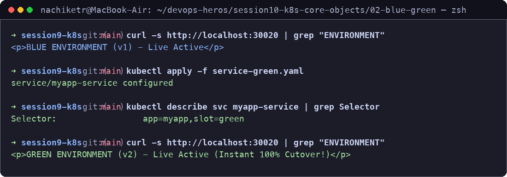

---

## Task 12: Canary Deployment Execution & Pod-Ratio Traffic Splitting

Deploy a 9-replica stable deployment (90%) and 1-replica canary deployment (10%) under the same Service. Run curl traffic sampling to verify the traffic ratio.

**Commands:**
```bash
cd 03-canary/

# 1. Deploy Stable baseline and Canary
kubectl apply -f deployment-stable.yaml
kubectl apply -f service.yaml
kubectl apply -f deployment-canary.yaml

# 2. Verify traffic split across 10 curl requests
for i in $(seq 1 10); do curl -s http://localhost:30030 | grep -o "STABLE v1\|CANARY v2"; done

# 3. Scale Canary to 30% and test rollback
kubectl scale deployment app-canary --replicas=3
kubectl scale deployment app-stable --replicas=7
kubectl scale deployment app-canary --replicas=0 # Instant rollback

# Cleanup
kubectl delete -f service.yaml -f deployment-canary.yaml -f deployment-stable.yaml
```

**Output:**
```
STABLE v1
STABLE v1
STABLE v1
CANARY v2    # <-- ~10% Canary traffic share verified!
STABLE v1
STABLE v1
STABLE v1
STABLE v1
STABLE v1
STABLE v1
```

**Screenshot:**

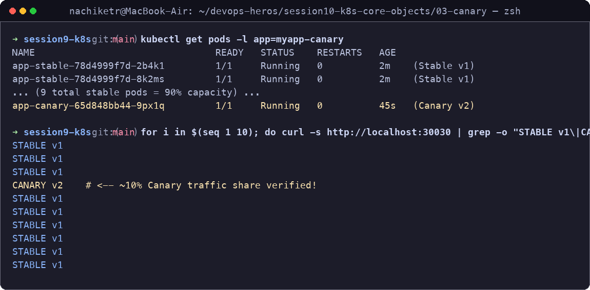

---

## Task 13: Recreate Deployment Execution & Downtime Outage Demonstration

Deploy an application with `strategy.type: Recreate` and capture the intentional downtime outage window where 0 pods exist between v1 termination and v2 initialization.

**Commands:**
```bash
cd 04-recreate/

# 1. Deploy v1 and service
kubectl apply -f deployment-v1.yaml
kubectl apply -f service.yaml

# 2. Run continuous polling loop and apply v2
while true; do curl -s --connect-timeout 1 http://localhost:30040 | grep -o 'VERSION: [^<]*' || echo "[OUTAGE] Connection refused / 0 pods alive"; sleep 0.5; done
kubectl apply -f deployment-v2.yaml

# 3. Rollback
kubectl rollout undo deployment/app-recreate
kubectl delete -f service.yaml -f deployment-v2.yaml
```

**Output:**
```
VERSION: v1
VERSION: v1
[OUTAGE] Connection refused / 0 pods alive   # v1 pods terminated
[OUTAGE] Connection refused / 0 pods alive   # 0 pods alive window
[OUTAGE] Connection refused / 0 pods alive   # v2 starting up
VERSION: v2 (UPGRADED)                        # Service restored
VERSION: v2 (UPGRADED)
```

**Screenshot:**

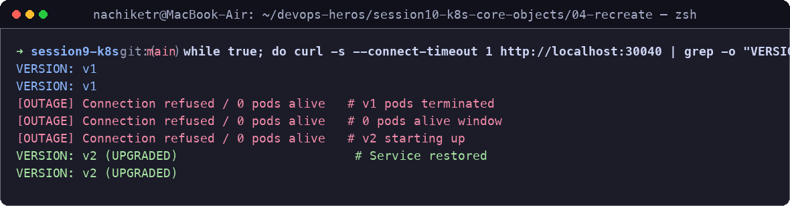
