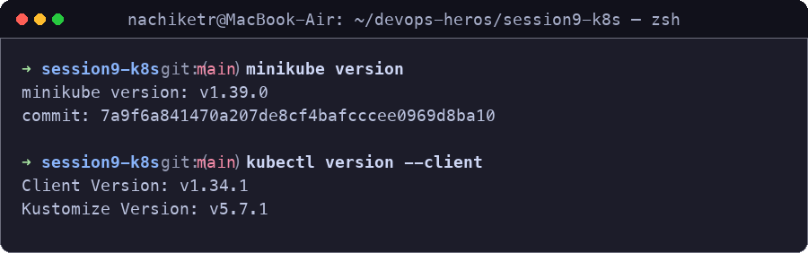
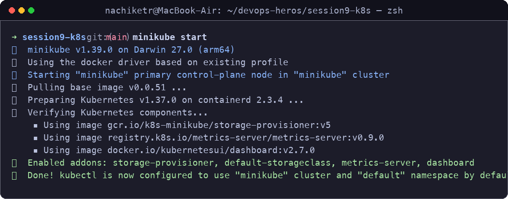
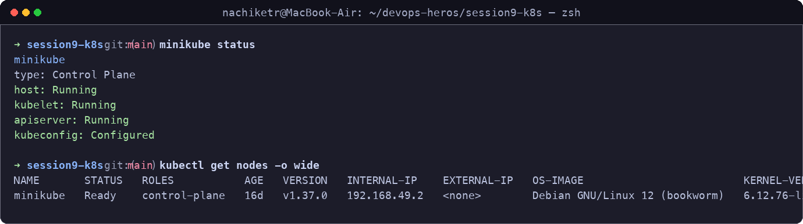
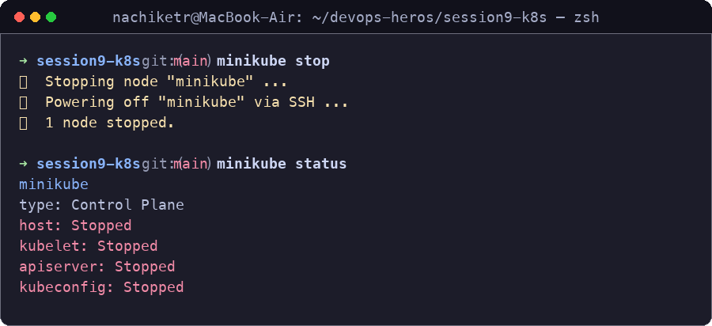

# Session 9: Kubernetes Fundamentals & Cluster Architecture

**Author:** Nachiketas Iyer  
**Roll Number:** 24bcs10131  
**Course:** SST DevOps & Cloud [SWE]  
**Session:** 09 - Kubernetes Fundamentals  
**Repository:** devops-heros / session9-k8s  

---

## Task 1: Minikube & CLI Installation Verification

Verify that Minikube and the Kubernetes CLI (`kubectl`) are successfully installed on the local system.

**Commands:**
```bash
minikube version
kubectl version --client
```

**Output:**
```
minikube version: v1.39.0
commit: 7a9f6a841470a207de8cf4bafcccee0969d8ba10

Client Version: v1.34.1
Kustomize Version: v5.7.1
```

**Screenshot:**



---

## Task 2: Starting the Minikube Kubernetes Cluster

Initialize the local single-node Kubernetes cluster using the containerized runtime environment.

**Command:**
```bash
minikube start
```

**Output:**
```
😄  minikube v1.39.0 on Darwin 27.0 (arm64)
✨  Using the docker driver based on existing profile
👍  Starting "minikube" primary control-plane node in "minikube" cluster
🚜  Pulling base image v0.0.51 ...
🐳  Preparing Kubernetes v1.37.0 on containerd 2.3.4 ...
🔎  Verifying Kubernetes components...
    ▪ Using image gcr.io/k8s-minikube/storage-provisioner:v5
    ▪ Using image registry.k8s.io/metrics-server/metrics-server:v0.9.0
    ▪ Using image docker.io/kubernetesui/dashboard:v2.7.0
🌟  Enabled addons: storage-provisioner, default-storageclass, metrics-server, dashboard
🏄  Done! kubectl is now configured to use "minikube" cluster and "default" namespace by default
```

**Screenshot:**



---

## Task 3: Verifying Cluster Status & Node Health

Inspect the status of the local cluster control plane, kubelet, API server, and verify the node is in `Ready` state.

**Commands:**
```bash
minikube status
kubectl get nodes -o wide
```

**Output:**
```
minikube
type: Control Plane
host: Running
kubelet: Running
apiserver: Running
kubeconfig: Configured

NAME       STATUS   ROLES           AGE   VERSION   INTERNAL-IP    EXTERNAL-IP   OS-IMAGE                         KERNEL-VERSION             CONTAINER-RUNTIME
minikube   Ready    control-plane   16d   v1.37.0   192.168.49.2   <none>        Debian GNU/Linux 12 (bookworm)   6.12.76-linuxkit (arm64)   containerd://2.3.4
```

**Screenshot:**



---

## Task 4: Stopping the Minikube Cluster

Gracefully power down the Minikube cluster VM/container to release system resources.

**Commands:**
```bash
minikube stop
minikube status
```

**Output:**
```
✋  Stopping node "minikube" ...
🛑  Powering off "minikube" via SSH ...
🛑  1 node stopped.

minikube
type: Control Plane
host: Stopped
kubelet: Stopped
apiserver: Stopped
kubeconfig: Stopped
```

**Screenshot:**



---

## Task 5: Kubernetes Cluster Architecture & Component Analysis

Comprehensive breakdown of the core components powering a Kubernetes cluster based on official documentation and classroom discussion.

```
+-------------------------------------------------------------------------------+
|                               CONTROL PLANE (MASTER)                          |
|                                                                               |
|   +-------------------+       +--------------------+       +--------------+   |
|   |       etcd        |<----->|  kube-apiserver    |<----->|kube-scheduler|   |
|   | (State Database)  |       |    (Front Door)    |       +--------------+   |
|   +-------------------+       +---------+----------+                          |
|                                         |                                     |
|                                         v                                     |
|                             +------------------------+                        |
|                             | kube-controller-manager|                        |
|                             +------------------------+                        |
+-----------------------------------------+-------------------------------------+
                                          |
                        +-----------------+-----------------+
                        |                                   |
                        v                                   v
+------------------------------------+ +------------------------------------+
|          WORKER NODE 1             | |          WORKER NODE 2             |
|                                    | |                                    |
|   +------------+  +------------+   | |   +------------+  +------------+   |
|   |  kubelet   |  | kube-proxy |   | |   |  kubelet   |  | kube-proxy |   |
|   +-----+------+  +-----+------+   | |   +-----+------+  +-----+------+   |
|         |               |          | |         |               |          |
|         v               v          | |         v               v          |
|   +----------------------------+   | |   +----------------------------+   |
|   | CRI (containerd runtime)   |   | |   | CRI (containerd runtime)   |   |
|   +----------------------------+   | |   +----------------------------+   |
|         |                          | |         |                          |
|         v                          | |         v                          |
|   +------------+  +------------+   | |   +------------+  +------------+   |
|   |   Pod 1    |  |   Pod 2    |   | |   |   Pod 3    |  |   Pod 4    |   |
|   | [Container]|  | [Container]|   | |   | [Container]|  | [Container]|   |
|   +------------+  +------------+   | |   +------------+  +------------+   |
+------------------------------------+ +------------------------------------+
```

### 1. Control Plane (Master Node) Components

- **`kube-apiserver` (The Front Door)**:
  - Acts as the central communication hub and single entry point for all administrative tasks and internal operations.
  - Exposes the Kubernetes HTTP/JSON REST API.
  - Validates and configures data for API objects (Pods, Services, ReplicationControllers). Every administrative command (`kubectl`, Web UI, or internal controllers) must authenticate and communicate through the API server. No component directly accesses `etcd` except `kube-apiserver`.

- **`etcd` (The Brain & State Storage)**:
  - A distributed, consistent, highly available key-value store.
  - Holds the cluster's entire source of truth, configuration data, secrets, and metadata.
  - *Key Concept:* All Kubernetes objects have declarative specifications whose desired and current states are continuously tracked in `etcd`.

- **`kube-scheduler` (The Placement Engine)**:
  - Watches for newly created Pods with no assigned worker node.
  - Evaluates node resource capacity (CPU, memory, storage limits), affinity/anti-affinity rules, taints, tolerations, and data locality to place Pods onto optimal worker nodes.

- **`kube-controller-manager` (The Enforcer / Reconciliation Loop)**:
  - Runs continuous background controller loops that compare the **Current State** with the **Desired State** and drives reconciliation.
  - Sub-controllers include:
    - *Node Controller:* Tracks node availability and manages node eviction when heartbeats stop.
    - *ReplicaSet Controller:* Ensures the exact desired replica count of Pods is alive at all times.
    - *Service / EndpointSlice Controller:* Bridges Services with matching Pod IP addresses.

---

### 2. Worker Node (Data Plane) Components

- **`kubelet` (The Node Captain)**:
  - The primary node agent that registers the node with the Control Plane.
  - Takes `PodSpec` manifests delivered by the `kube-apiserver` and interfaces with the Container Runtime to start, stop, and monitor container execution.
  - Performs liveness, readiness, and startup health probes and sends node status reports back to the API server.

- **`kube-proxy` (The Network Router)**:
  - A network proxy running on each node that implements Kubernetes Service abstractions.
  - Maintains `iptables` / `IPVS` packet-forwarding rules on the host to route TCP/UDP/SCTP traffic across backend Pods with built-in client-side load balancing.

- **`Container Runtime Interface (CRI)`**:
  - The underlying software engine that pulls images, runs containers, and manages sandbox isolation.
  - Standardized via the Container Runtime Interface (CRI), using modern runtimes like **`containerd`** or **`CRI-O`**.

- **`Pod` (The Smallest Deployable Unit)**:
  - The atomic unit of deployment in Kubernetes.
  - Encapsulates one or more closely coupled containers sharing the same network namespace (IP address and port space), storage volumes, and IPC space.
